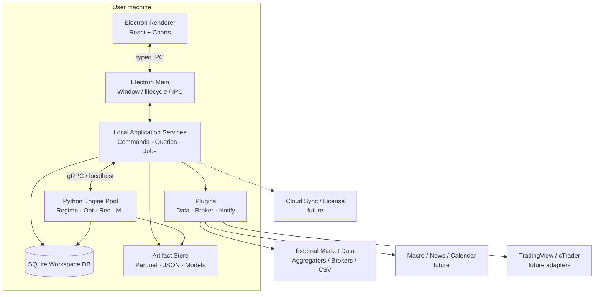
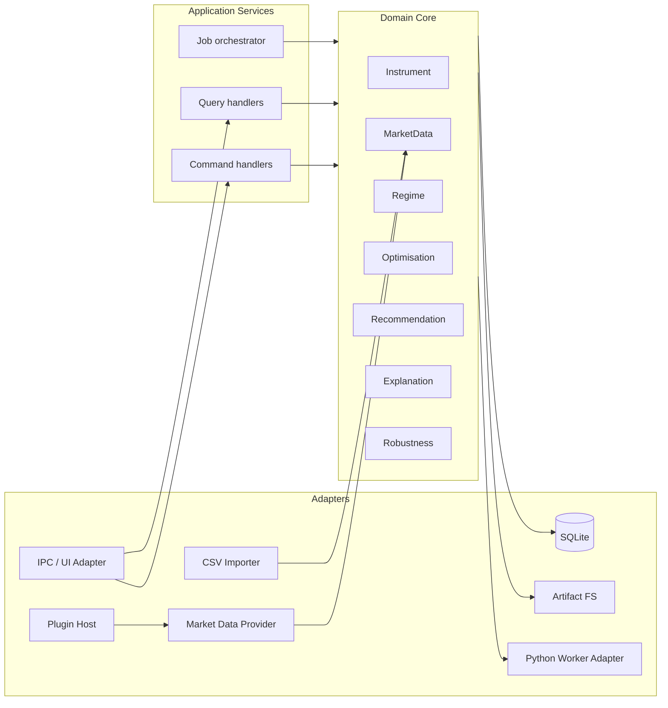
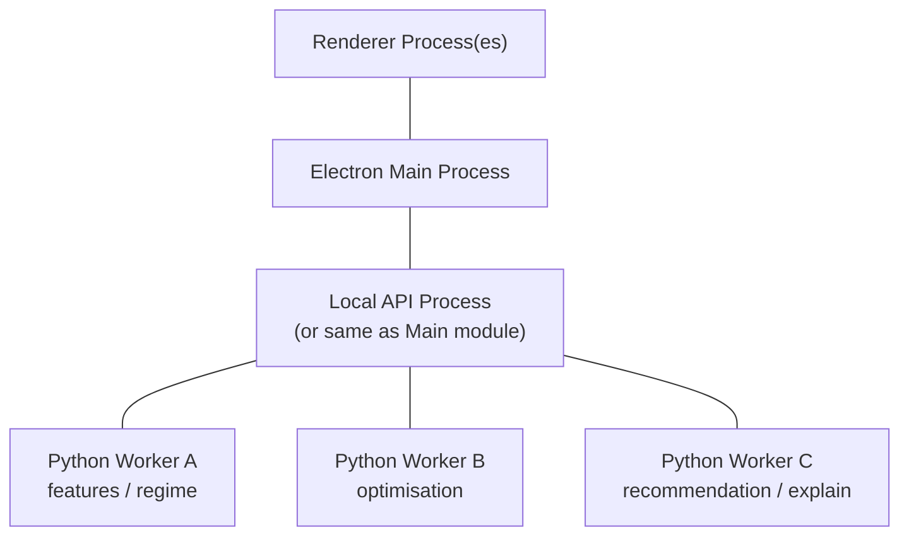
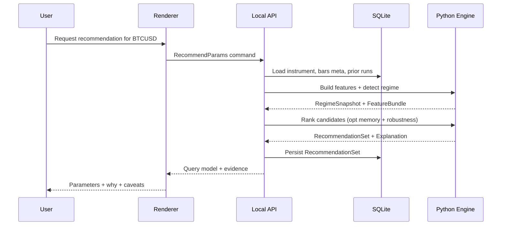

# Full Software Architecture

## Product intent (architectural implications)

| Goal | Architectural consequence |
|---|---|
| Regime awareness | First-class `MarketRegime` model + feature store snapshots |
| Robust parameters | Optimisation + recommendation as separate engines with shared evidence |
| Explainability | `ExplanationGraph` / evidence documents stored with every output |
| Learn from history | `OptimisationRun` memory is a queryable corpus, not disposable CSV dumps |
| Avoid curve fitting | Multi-metric scoring, OOS contracts, plateau detection as domain services |
| Continuous improvement | Versioned engines, feedback events (`RecommendationAccepted`, `LiveOutcome`) |
| Unlimited markets | Instrument registry + provider mapping adapters |
| Future plugins / brokers / calendar / chat | Port–adapter + capability-declared plugins |

## Context diagram

## Logical architecture (hexagonal / ports & adapters)

Ports (examples):

- `IMarketDataPort` — fetch / stream / import bars
- `IFeatureComputePort` — technical + macro features
- `IRegimeDetectorPort` — label regimes for a window
- `IOptimisationPort` — run parameter search with constraints
- `IRecommendationPort` — produce ranked, explained parameter sets
- `IBrokerPort` — future trade read/write (not execution-critical in v1)
- `INotifierPort` — future Telegram / desktop notifications
- `ISyncPort` — future cloud sync

## Process architecture (desktop)

**Isolation rules**

- UI never loads multi-GB bar arrays into React state; charts request windowed series.
- Optimisation never runs in the renderer or main thread.
- Worker pool size defaults to `max(1, cpuCount - 1)` and is settings-capped.
- Crash of a worker fails the job; does not crash the UI.

## Domain aggregates (bounded contexts)

| Bounded context | Aggregate roots | Responsibility |
|---|---|---|
| Catalog | `Instrument`, `Workspace` | Symbols, mappings, user workspace |
| Market Data | `Series`, `BarBatch`, `IngestJob` | OHLCV integrity, gaps, quality flags |
| Structure | `StructureSnapshot` | Swings, levels, volatility state |
| Macro | `MacroEvent`, `MacroContext` | Calendar / news context (stub → full) |
| Regime | `RegimeModel`, `RegimeTimeline` | Labels + confidence + transitions |
| Optimisation | `StrategyDefinition`, `OptimisationRun` | Search space, results, OOS metrics |
| Recommendation | `RecommendationSet`, `ParameterSet` | Ranked settings + explanations |
| Feedback | `OutcomeEvent` | Live/bot results linked to recommendations |
| Platform | `Job`, `Plugin`, `Settings`, `License` | Cross-cutting |

## Event & job model

Long work is **asynchronous**:

1. UI issues command (`StartOptimisation`).
2. App service creates `Job` + `OptimisationRun` (status=`queued`).
3. Orchestrator claims job, dispatches to Python via gRPC.
4. Worker streams `JobProgress` events (IPC → UI).
5. On completion, artifacts written; status=`completed`; query projections updated.
6. Failures set status=`failed` with typed `ErrorCode` and retry policy.

Domain events (local, durable outbox later if sync needed):

- `BarsIngested`
- `RegimeSnapshotComputed`
- `OptimisationCompleted`
- `RecommendationIssued`
- `RecommendationAccepted`
- `RecommendationRejected`
- `LiveOutcomeRecorded`

## Data flow (recommendation path)

## Scalability model (desktop)

“Scalable” here means:

- **Data volume**: billions of bars via columnar artifacts + windowed queries
- **Compute**: multi-process workers, cancellable jobs, disk-backed intermediate results
- **Markets**: horizontal instrument registry, not hardcoded lists
- **Features**: plugin-supplied feature extractors
- **Team scale**: monorepo packages with clear ownership boundaries

Not: infinite cloud horizontal scale in v1 (optional later via sync service).

## Security architecture (baseline)

- Context isolation + no Node in renderer
- Capabilities for filesystem scoped to workspace directory
- Secrets in OS keychain
- Plugin capability allowlist
- Optional future: code signing + update channel authenticity

## Reliability

- Job idempotency keys
- Transactional state transitions
- Artifact checksums
- Crash recovery on startup (`running` → `interrupted` → resume/cancel policy)
- Schema migrator on app boot

## Consistency of scientific results

Each run stores:

- `engineVersion`
- `code hash` / build id
- `config hash`
- `data fingerprint` (bar range + checksum)
- `randomSeed`

Enables auditability and “continuous improvement” without silent drift.

## Mapping to long-term features

| Future feature | Extension point |
|---|---|
| Economic calendar | `IMacroPort` + Macro context bounded context |
| Market news | News adapter → NLP features plugin |
| AI chat assistant | RAG over explanations + domain tools (see AI arch) |
| Walk-forward / Monte Carlo | Optimisation engine stages (already sketched) |
| ML models | Model registry + `IModelPort` |
| Portfolio analysis | New bounded context; consumes instruments + recs |
| Cloud sync | `ISyncPort` + outbox |
| Telegram alerts | `INotifierPort` plugin |
| cTrader / TradingView / multi-broker | `IBrokerPort` / `IChartInteropPort` adapters |
| Historical replay | Replay service reading Series + clock |

## Quality gates for architecture changes

Any new module must declare:

1. Bounded context
2. Ports used/provided
3. Tables/artifacts touched
4. Jobs introduced
5. Failure modes
6. Test strategy
7. Plugin/surface impact
