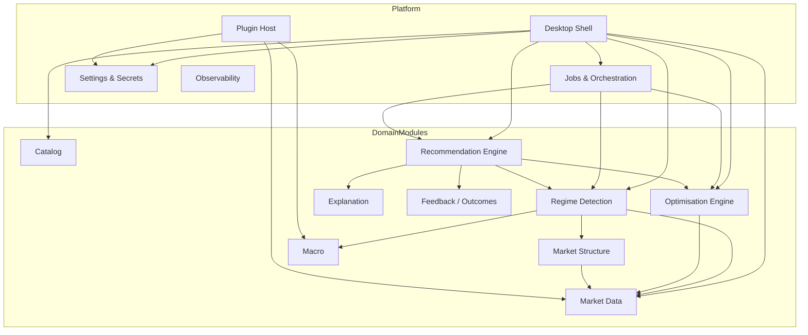

# Module Breakdown

Each module is a replaceable unit with a clear ownership boundary, public ports, and private implementation.

## Module map

---

## Platform modules

### 1. Desktop Shell (`apps/desktop`)

| | |
|---|---|
| **Purpose** | Windowing, routing, IPC bridge, theming, accessibility chrome |
| **Owns** | Electron main/preload/renderer composition |
| **Depends on** | Local API queries/commands via IPC; `contracts`; `ui-kit` |
| **Replaceable by** | Alternate UI shell speaking the same IPC contract (e.g. future Tauri) |
| **v1 deliverable** | App frame, navigation, job toaster, empty feature routes |

### 2. Local Application Services (`apps/local-api`)

| | |
|---|---|
| **Purpose** | CQRS-lite command/query handlers, transactions, authorization of local ops |
| **Owns** | Use-case orchestration; never heavy numerics |
| **Depends on** | Prisma, Python bridge, artifact FS, plugin host |
| **Replaceable by** | Same contracts on another Node framework |

### 3. Jobs & Orchestration

| | |
|---|---|
| **Purpose** | Queue, schedule, cancel, resume long-running work |
| **Owns** | `Job` entity, progress events, worker assignment |
| **Inputs** | Job requests from domain modules |
| **Outputs** | Status transitions + progress streams |
| **Failure** | Mark failed/interrupted; never leave `running` across unclean shutdown without repair |

### 4. Settings & Secrets

| | |
|---|---|
| **Purpose** | User preferences, engine defaults, secret references |
| **Owns** | Settings schema + keychain references |
| **See** | [13-settings-storage.md](13-settings-storage.md) |

### 5. Plugin Host

| | |
|---|---|
| **Purpose** | Load, validate, sandbox, invoke plugins |
| **See** | [14-plugin-architecture.md](14-plugin-architecture.md) |

### 6. Observability

| | |
|---|---|
| **Purpose** | Structured logs, job traces, perf timers, diagnostics export |
| **Owns** | Log sinks under workspace `logs/` |
| **v1** | JSON logs + correlation `requestId` / `jobId` |

---

## Domain modules

### 7. Catalog

- Instrument registry, asset classes, provider symbol maps
- Seed: BTCUSD, ETHUSD, XAUUSD, EURUSD, NAS100, SPX500
- APIs: `ListInstruments`, `UpsertInstrument`, `ResolveSymbol`

### 8. Market Data

- Ingest CSV / provider bars, validate continuity, store series metadata
- Quality flags: gaps, duplicates, spikes, session holes
- APIs: `ImportBars`, `GetSeriesWindow`, `GetDataFingerprint`
- Storage split: metadata in SQLite; bulk bars in Parquet partitions

### 9. Market Structure

- Swings, ranges, breakouts, volatility regimes features, liquidity proxies
- Produces `StructureSnapshot` for a time window / timeframe
- Consumed by regime + explanation

### 10. Macro

- v1: schema + stub adapter (empty calendar)
- Later: economic calendar intensity, event proximity features, news sentiment
- Must **never** block core path when offline

### 11. Regime Detection

- Labels market state over windows (e.g. trend / mean-reversion / high-vol / compression — exact taxonomy versioned)
- Outputs: `RegimeTimeline`, `currentRegime`, confidence, transition probabilities
- Implementation lives primarily in Python; Node stores and queries results

### 12. Optimisation Engine

- Strategy parameter search under constraints
- Walk-forward, OOS metrics, plateau detection, (later) Monte Carlo
- Persists full run metadata + result tables as artifacts
- See [10-optimisation-engine.md](10-optimisation-engine.md)

### 13. Recommendation Engine

- Consumes regime + structure + optimisation memory + robustness scores
- Emits ranked `ParameterSet`s with `ExplanationDocument`s and overfit risk
- See [11-recommendation-engine.md](11-recommendation-engine.md)

### 14. Explanation

- Normalizes evidence into UI-ready structured documents
- Sections: regime rationale, metric drivers, stability, caveats, rejected alternatives
- Shared by recommendation UI and future AI chat RAG

### 15. Feedback / Outcomes

- Records whether user accepted recommendations and subsequent bot performance (imported or linked)
- Closes the learning loop without autodestroying scientific hygiene (outcomes are labels, not automatic param overwrites)

---

## Cross-cutting Python packages (`mia_engine`)

| Package | Responsibility |
|---|---|
| `features/` | Feature computation pipelines |
| `regime/` | Detectors & model inference |
| `optimisation/` | Search + validation stages |
| `recommendation/` | Ranking / blending / risk scoring |
| `explanation/` | Evidence assembly |
| `ml/` | Future training & model registry IO |
| `io/` | Parquet/SQLite access patterns |

---

## Module replaceability matrix

| If you replace… | You must keep… |
|---|---|
| Regime algorithm | `RegimeSnapshot` contract + job API |
| Chart library | Series window query + marker DTO mapping |
| SQLite provider | Prisma schema semantics (or migration layer) |
| Optimisation search (grid → Bayesian) | `OptimisationRun` artifact schema + scoring ports |
| Data vendor | `IMarketDataPort` |
| Electron | IPC contract + workspace paths |

---

## Testing ownership

| Module | Unit | Integration | E2E |
|---|---|---|---|
| Domain TS | Vitest pure functions | — | — |
| Local API | Handler tests w/ temp SQLite | Python bridge fixtures | — |
| Python engine | pytest | Golden datasets | — |
| Desktop | Component tests sparingly | — | Playwright smoke |
| Plugins | SDK conformance tests | Host load tests | — |

## Communication styles between modules

- **In-process function calls** within `local-api` modules
- **IPC** desktop ↔ local-api surface
- **gRPC** local-api ↔ python-engine
- **Artifacts on disk** for large payloads
- **Domain events** (DB table / in-process bus) for decoupling feedback loops
