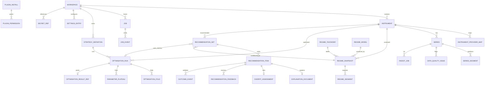
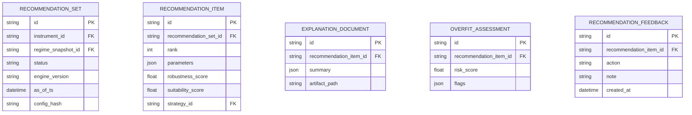
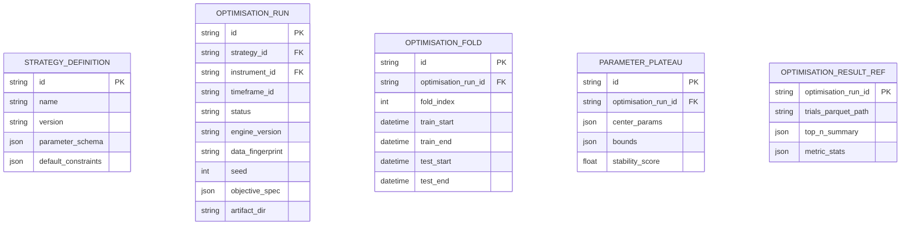
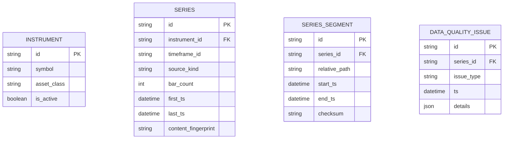

# Entity Relationship Diagram

## Core ERD (logical)



## Recommendation context (detail)



## Optimisation context (detail)



## Market data context (detail)



## Cardinality notes

| Relationship | Cardinality | Rule |
|---|---|---|
| Instrument → Series | 1:N | Multiple timeframes/sources allowed |
| OptimisationRun → Folds | 1:N | Walk-forward partitions |
| RecommendationSet → Items | 1:N | Typically top-K (K configurable, default 5) |
| Item → Explanation | 1:1 | Mandatory for published recommendations |
| Item → Feedback | 1:N | User may revise feedback |
| Item → Outcomes | 1:N | Multiple live windows possible |

## Artifact ER (filesystem, not SQL)

```text
artifacts/
  bars/{seriesId}/{yyyy}/{mm}.parquet
  features/{snapshotId}.parquet
  opt-runs/{runId}/
    config.json
    trials.parquet
    folds.json
    plateaus.json
    report.json
  recommendations/{setId}/
    items/{itemId}.json
    explanation/{itemId}.json
  models/regime/{modelId}/
```

SQL rows reference these paths; deleting a run deletes SQL + artifact directory in one command transaction (best-effort FS cleanup with tombstones if FS fails).
