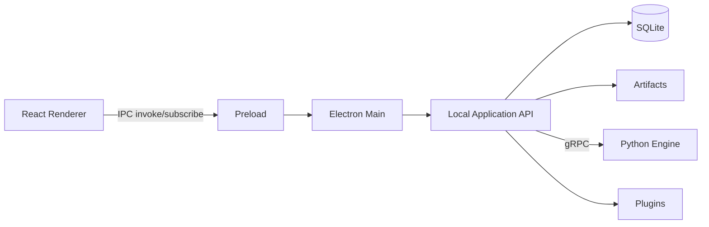

# API Architecture

The product is a **desktop** app. “API architecture” means the **internal local application API**, the **IPC contract**, and the **Python worker RPC** — not a public multi-tenant SaaS API in v1.

## Surfaces



Optional: bind `127.0.0.1` HTTP **only in development** for debugging (disabled in production builds by default).

## Design style

- **CQRS-lite:** `commands.*` mutate; `queries.*` read.
- **Jobs** for long operations; never block IPC for minutes.
- **Versioned** payloads (`contractVersion`).
- **Idempotency** keys on create/start commands.
- Validation: Zod on Node boundary; Pydantic on Python boundary; protobuf for RPC.

## IPC namespaces

| Namespace | Examples |
|---|---|
| `workspace.*` | `get`, `create`, `open`, `export` |
| `catalog.*` | `listInstruments`, `upsertInstrument` |
| `marketData.*` | `importCsv`, `getSeriesMeta`, `getBarsWindow` |
| `structure.*` | `getLatestSnapshot`, `recompute` |
| `regime.*` | `getCurrent`, `getTimeline`, `recompute` |
| `optimisation.*` | `start`, `cancel`, `getRun`, `listRuns`, `getTopTrials` |
| `recommendation.*` | `generate`, `getSet`, `list`, `accept`, `reject` |
| `jobs.*` | `get`, `list`, `subscribeProgress` |
| `settings.*` | `getAll`, `set`, `setSecret`, `deleteSecret` |
| `plugins.*` | `list`, `install`, `enable`, `disable` |
| `diagnostics.*` | `exportLogs`, `doctor` |

### IPC patterns

- **Request/response** for commands/queries (`ipcMain.handle`)
- **Event channels** for progress (`job:progress`, `job:completed`, `job:failed`)
- All channels gated through `preload` allowlist — no free `ipcRenderer` to arbitrary channels

## Command examples (conceptual)

### `marketData.importCsv`

Request:

- `instrumentId` | `symbol`
- `timeframe`
- `filePath`
- `options` (delimiter, timezone, dedupe policy)

Response:

- `ingestJobId`, `seriesId`, `qualitySummary`

### `optimisation.start`

Request:

- `strategyId`, `instrumentId`, `timeframe`
- `dateRange`, `objectiveSpec`, `searchSpec`, `seed?`
- `idempotencyKey`

Response:

- `jobId`, `optimisationRunId`

### `recommendation.generate`

Request:

- `instrumentId`, `timeframe`, `strategyId?`, `asOfTs?`
- `constraints` (max leverage analog, trade frequency floors, etc.)

Response:

- `jobId`, `recommendationSetId` (completed synchronously only if cached & tiny — default async)

## Query examples

- `queries.regime.getCurrent(instrumentId, timeframe)`
- `queries.recommendation.getSet(setId)` → items + explanations + overfit
- `queries.marketData.getBarsWindow(seriesId, from, to, limit)`
- `queries.optimisation.getPlateaus(runId)`

## Python gRPC services

| Service | RPCs (illustrative) |
|---|---|
| `FeatureService` | `ComputeFeatures` |
| `RegimeService` | `DetectRegime`, `BuildTimeline` |
| `OptimisationService` | `RunOptimisation` (server-streaming progress) |
| `RecommendationService` | `Recommend` |
| `ExplanationService` | `BuildExplanation` |
| `HealthService` | `Ping`, `Version` |

Large results return **artifact URIs**, not inline trial arrays.

## Error model

Typed error envelope:

```text
{
  code: "DATA_GAP" | "INVALID_PARAM_SPACE" | "ENGINE_CRASH" | "CANCELLED" | ...,
  message: string,
  details?: object,
  retryable: boolean,
  correlationId: string
}
```

Map to UI actionable states (fix CTA, retry, open diagnostics).

## AuthN/AuthZ (local)

v1: single-user local trust boundary.

Later:

- License entitlements on command handlers
- Plugin capability checks
- Cloud account tokens only for sync/license adapters

## Rate limiting & backpressure

- Cap concurrent optimisation jobs (default 1 heavy job)
- Queue additional requests
- Cancel propagation to Python workers
- Chart queries coalesced / window-limited

## Public/Open API (explicitly future)

If a power-user HTTP API is later offered for automation:

- Local-only bind
- Token in keychain
- OpenAPI generated from contracts
- Same commands/queries — no second domain model

## Compatibility

`packages/contracts` is the source of truth for TS; `packages/proto` for Python RPC. CI fails if they drift (generated stubs + schema tests).
