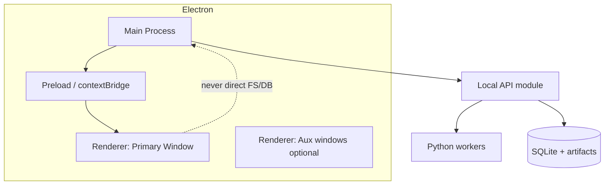

# Desktop Application Architecture

## Goals

- Commercial-quality desktop UX for multi-hour analysis sessions
- Keep UI responsive under heavy optimisation / ingest loads
- Offline-first workspace browsing
- Institutional information density **without** collapsing into generic dashboard chrome on every view
- Clear path for future AI chat sidebar, replay, and broker panels

## Process model

### Main process responsibilities

- App lifecycle, single-instance lock
- BrowserWindow creation / dual monitor preferences
- Native menus, file open dialogs
- Spawn/monitor local API + Python engine supervisor
- Auto-update hooks (later)
- Crash recovery prompts

### Preload

Exposes a **narrow typed API**: `window.mia.api.invoke`, `window.mia.api.on`.  
No Node primitives in the renderer.

### Renderer

- React application with feature-based folders
- Client state: UI-only (selections, panel layout); server/workspace state via queries
- Prefer streaming job updates over polling

## UI information architecture (v1)

Primary navigation (one job per major area):

1. **Workspace / Home** — recent instruments, jobs, last recommendations
2. **Markets** — instrument catalog + data health
3. **Chart & Structure** — primary visual analysis surface
4. **Regime** — current label, timeline, confidence
5. **Optimisation** — runs, configs, result explorer
6. **Recommendations** — ranked params + explanations (core product surface)
7. **Jobs** — queue & history
8. **Settings** — preferences, engines, plugins, secrets

### Recommendations view (flagship)

Composition priorities:

- Instrument + regime context as the primary scene setting
- Ranked parameter sets with robustness emphasis
- Explanation panel as first-class, not a footnote
- Overfit risk visible before accept actions
- Avoid stacking unrelated promo-like stat strips

### Chart view

- Full-bleed chart canvas as the visual plane for that section
- Overlays: structure markers, regime color bands, recommendation annotations
- Data windowing; virtualization for long histories

## State management

| Layer | Tooling suggestion |
|---|---|
| Server/cache | TanStack Query talking to IPC |
| UI ephemeral | React local state / light Zustand if needed |
| Forms | React Hook Form + Zod |
| Jobs | Dedicated subscription store keyed by `jobId` |

**No** Redux mega-store for domain entities — the DB is the source of truth.

## Theming & design system

- `packages/ui-kit` design tokens (color, type, space, motion)
- Expressive typography suitable for a trading product (not default system/Inter-only identity)
- Atmospheric backgrounds allowed on brand/home surfaces; analysis screens prioritize clarity and contrast for data
- Motion: purposeful transitions for job completion, regime change highlights, recommendation reveal — 2–3 intentional motions, not noise
- Dark/light both supported; do not lock architecture to dark-only

Preserve any future brand guidelines here; architecture only requires tokenized theming.

## Performance budget

| Interaction | Target |
|---|---|
| Navigate between routes | < 100ms perceived |
| Open chart window (warm cache) | < 300ms to first paint |
| Scroll chart pan | 60fps |
| Optimisation progress tick | UI never blocks |
| App cold start to interactive shell | < 3s on reference hardware |

Techniques: code splitting per feature route, worker offload, Parquet window reads, canvas chart ownership of series.

## Multi-window (optional later)

- Detachable chart window
- Detached job monitor
- Uses same IPC API; window state in settings

## Accessibility

- Keyboard navigation for tables and rank lists
- Focus management on modal job cancellation
- Contrast-safe regimes overlays

## Internationalization

- Message catalog structure from v1 even if English-only initially
- Number/date formatting by locale; financial formats configurable

## Packaging & updates

- `electron-builder` targets: NSIS / DMG / AppImage (adjust per commercial policy)
- Code signing mandatory for public release phase
- Differential updates via `electron-updater` when license cloud exists

## Failure UX

| Failure | UX |
|---|---|
| Python engine down | Banner + retry + diagnostics |
| Corrupt DB | Repair wizard / restore backup |
| Import quality issues | Blocking summary with downloadable report |
| Ambiguous optimisation cancel | Run marked cancelled; partial artifacts quarantined |

## Security checklist (desktop)

- `contextIsolation: true`, `nodeIntegration: false`
- `sandbox: true` where compatible with tooling
- Navigation allowlist
- External links open in OS browser
- File dialogs for imports (no arbitrary remote HTML)

## Testing the shell

- Main-process unit tests for path/resolver helpers
- Preload contract tests
- Playwright smoke: boot → open workspace → navigate recommendations
