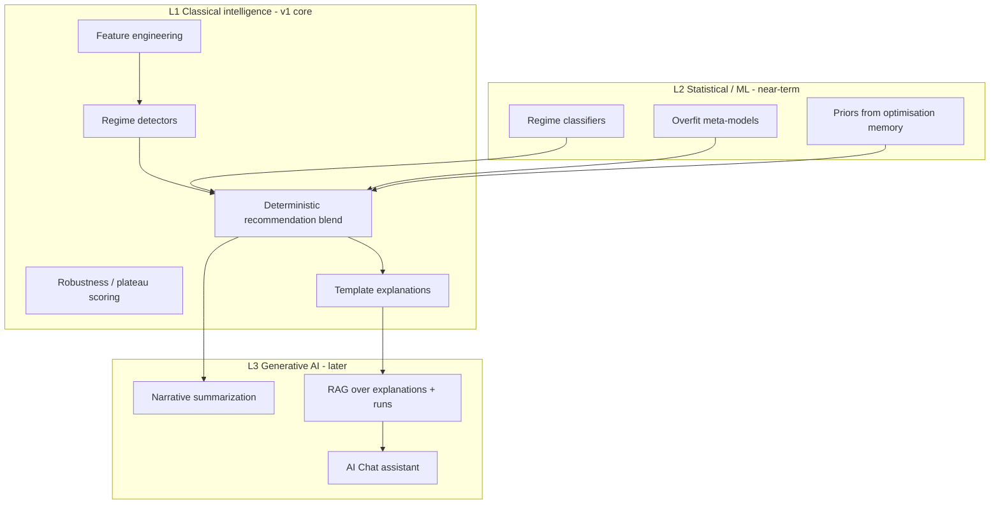

# AI Architecture

AI in Market Intelligence AI is **decision support**, not price prophecy. Models assist with regime labeling, robustness scoring, explanation synthesis, and (later) conversational retrieval over the user’s own evidence.

## Principles

1. **Grounding** — Model outputs must cite stored evidence (regime snapshots, metrics, plateaus).
2. **Separability** — LLM layers never own trading parameters; they narrate/rank under rules engines.
3. **Local-first optionality** — Core pipelines run offline with classical ML / rules; cloud LLMs are optional enhancers.
4. **Version everything** — Model registry entries include training data fingerprint + metrics.
5. **Human accept** — Bots receive parameters only after user acceptance (or explicit auto-apply policy later).

## Capability layers

## L1 — Core (required for v1 foundation)

| Component | Role |
|---|---|
| Feature pipeline | Returns / vol / ranges / structure descriptors / session stats |
| Regime detector | HMM / threshold / classifier — pluggable via `IRegimeDetectorPort` |
| Robustness scorer | Plateau width, OOS degradation, parameter sensitivity |
| Recommendation blender | Weighted multi-objective ranker under constraints |
| Explanation templates | Structured evidence → deterministic narrative sections |

These are **fully offline**.

## L2 — Statistical / ML

| Model | Input | Output |
|---|---|---|
| Regime classifier | Feature windows | Label + confidence |
| Transition model | Regime histories | Transition probabilities |
| Overfit risk model | Train/OOS gaps, complexity, trade counts | Risk score 0–1 |
| Prior model | Historical accepted runs + outcomes | Soft priors over param regions |

Training workflow (later implementation):

1. Freeze dataset snapshot + fingerprint
2. Train in Python offline job
3. Register model artifact under `artifacts/models/`
4. Shadow-evaluate vs previous champion
5. Promote via settings (`activeRegimeModelId`)

## L3 — Generative assistant (roadmap)

### Tool-using agent (recommended pattern)

The chat agent **does not** invent metrics. It calls tools:

- `get_current_regime`
- `get_recommendation_set`
- `get_explanation`
- `search_optimisation_runs`
- `get_data_quality`
- `compare_parameter_sets`

LLM produces wording + suggested next questions; tools produce facts.

### RAG corpus

Indexed locally (e.g. SQLite FTS / LanceDB later):

- Explanation documents
- Optimisation reports
- User notes / feedback
- Architecture help docs (optional)

### Providers

Adapter port `ILlmPort`:

- `local` (llama.cpp / Ollama) — air-gapped mode
- `cloud` (vendor APIs) — secrets via keychain
- `none` — chat disabled; L1 explanations remain

## Feature store (lightweight)

Not a full Feast deployment. Local design:

- Feature computation writes Parquet snapshots
- `feature_snapshot` metadata in SQLite
- Point-in-time correctness for training (`as_of_ts`)

## Avoiding curve fitting in AI layers

| Risk | Mitigation |
|---|---|
| Model memorizes specific OHLC | Emphasize regime/features + OOS |
| LLM invents Sharpe | Tool-only numbers; refuse freeform metrics |
| Feedback loop overfits accepts | Priors are Bayesian soft constraints; floors on trade counts; periodic purge of toxic priors |
| Train/serve skew | Shared feature code path in `mia_engine/features` |

## Explanation object (AI ↔ UI contract)

Minimum sections:

1. **Regime context** — label, confidence, supporting features
2. **Why these parameters** — metrics, plateau membership
3. **Robustness** — OOS behavior, sensitivity
4. **Risks / caveats** — data quality, regime instability, overfit score
5. **Alternatives rejected** — next-best and why ranked lower

Generative layer may rephrase 1–5; it may not add uncitable claims.

## Inference runtime

- Batch jobs for recompute-all-instruments overnight
- On-demand jobs for active instrument
- Latency classes: interactive (<2s for cached regime), analytical (seconds–minutes for recommend), heavy (optimisation hours)

## Evaluation harness

Golden datasets per symbol class (FX, crypto, metal, index) with expected regime annotations (human-labeled sample).  
CI can run smoke inference; full eval is a scheduled job.

## Privacy

- Local workspace never uploaded unless user enables sync
- Cloud LLM adapter redacts secrets and offers “local only” mode
- Export of anonymized diagnostics is explicit and user-triggered

## v1 AI scope (foundation)

Ship ports, schemas, job wiring, deterministic explanation templates, stub/pluggable regime detector.  
Do **not** require trained deep models or cloud LLM to use the app.
