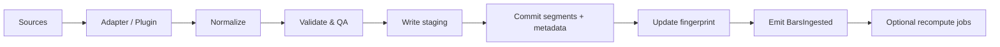
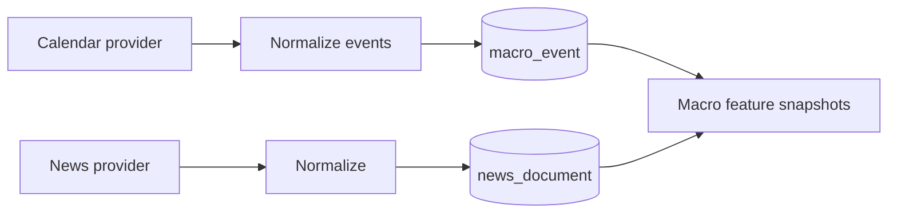

# Data Ingestion Architecture

## Purpose

Bring market (and later macro) data into a **validated, fingerprintable, offline-usable** local store that regime, optimisation, and recommendation engines can trust.

## High-level pipeline



## Sources (ports)

| Source kind | v1 | Later |
|---|---|---|
| CSV / TXT files | Yes | — |
| Native sample packs | Yes | — |
| Broker history APIs | Stub port | cTrader / others |
| Market data vendors | Stub port | Paid feeds |
| TradingView exports | — | Adapter |
| Replay clocks | — | Historical replay module |
| Macro calendars | Stub | Full calendar provider |
| News feeds | — | Plugin |

All sources implement `IMarketDataPort` / `IMacroPort`.

## Normalization contract

Canonical bar:

| Field | Notes |
|---|---|
| `ts` | UTC epoch ms (inclusive open time policy documented per timeframe) |
| `open` `high` `low` `close` | Decimal as string or fixed-scale integer; engine uses float64 carefully |
| `volume` | Optional; 0 if unknown |
| `quality` | Per-bar flags optional |

Instrument resolution: symbol → `InstrumentId` via Catalog (aliases supported).

Timeframe normalization: `1m`, `5m`, `15m`, `1h`, `4h`, `1d` as first-class; custom aggregations from base timeframe allowed later.

## Validation & data quality

Checks (blocking vs warning configurable):

| Check | Severity |
|---|---|
| Schema / column mapping failure | Blocking |
| Non-monotonic timestamps | Blocking |
| Duplicates | Blocking or auto-dedupe |
| Missing bars vs session calendar | Warning / gap fill policy |
| OHLC inconsistencies (`high < low`, etc.) | Blocking |
| Extreme spikes vs robust z-score | Warning |
| Timezone ambiguity | Blocking until user confirms |

Results stored in `data_quality_issue` + ingest report artifact.

## Write path

1. **Stage** bars in temp Parquet
2. Run validators
3. On success, move into `artifacts/bars/{seriesId}/…`
4. Insert/update `series_segment` rows
5. Recompute `content_fingerprint` (hash of segment checksums + range)
6. Commit SQLite transaction
7. Emit domain event

Failure mid-way leaves staging GC’d; no half-visible series updates.

## Partitioning

Recommended layout:

```text
artifacts/bars/{seriesId}/timeframe={tf}/year={yyyy}/month={mm}.parquet
```

Enables prune-on-read for chart windows and feature jobs.

## Incremental ingest

- Append-only if `new_first_ts > series.last_ts`
- Overlap windows trigger reconcile policy: `reject` | `replace_overlap` | `keep_existing`
- Provider cursors stored on `series` (`cursor_token`)

## Streaming / realtime (phase-gated)

v1 focuses on historical batches. Architecture reserves:

- `IMarketDataPort.subscribe(instrument, timeframe)`
- Debounced bar-close events → optional partial feature update
- Realtime must not rewrite historical fingerprints silently; live tip is a separate `live_tip` cache

## Macro ingestion (future-ready)



Macro never blocks market-data-only workflows; recommendation may run with `macro=unavailable`.

## Performance

- Prefer Polars for CSV → Parquet transforms in Python worker
- Node handles dialogs, job state, metadata commits
- Large imports are jobs with progress (bytes + rows)

## Security

- Import paths from OS file dialog or workspace sandbox
- Remote download adapters need allowlisted hosts + checksum verification
- No automatic execution of embedded scripts in CSV plugins

## Testing

- Golden CSV fixtures for each v1 symbol
- Property tests for OHLC invariants
- Fingerprint stability tests (same file → same hash)
