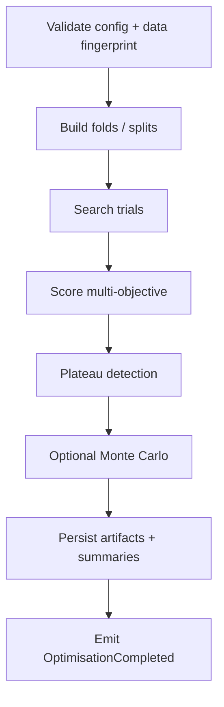
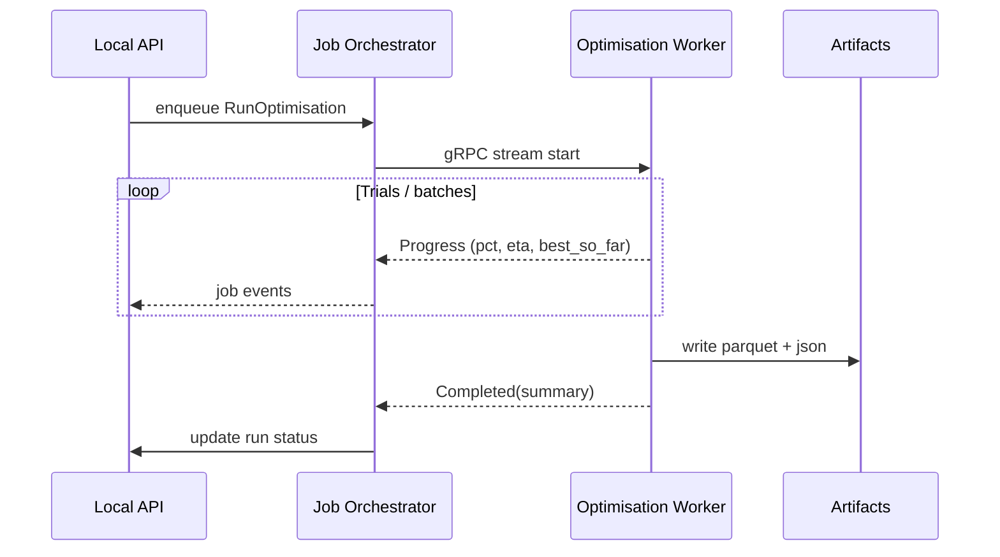

# Optimisation Engine Architecture

## Purpose

Search strategy parameter spaces and produce **auditable, OOS-aware** result corpora that the recommendation engine can trust. Peak in-sample profit is never the sole success criterion.

## Placement

- **Orchestration / persistence:** `local-api` Optimisation module + Jobs
- **Numerics / search:** `apps/python-engine/mia_engine/optimisation`
- **Strategy fitness function:** pluggable adapter (`IStrategyEvaluatorPort`) so engines are not coupled to one bot vendor

## Pipeline stages



v1 foundation implements A–E with Monte Carlo as a staged stub interface.

## Core concepts

### Strategy definition

Declares:

- Parameter schema (names, types, bounds, step/continuous)
- Constraints (e.g. SL < entry distance rules)
- Evaluator binding (`builtin:sim`, `plugin:ctrader`, `external:user-script`)

### Objective specification (multi-objective)

Example dimensions (configurable weights / hard constraints):

| Metric | Role |
|---|---|
| Expectancy / profit factor | Performance |
| Max drawdown | Risk ceiling (constraint or objective) |
| Sharpe / Sortino | Risk-adjusted |
| Trade count | Statistical significance floor |
| OOS / IS degradation | Overfit penalty |
| Parameter stability | Plateau membership score |

Hard constraints reject trials before ranking (e.g. `trades >= N`, `maxDD <= X`).

### Search strategies (pluggable)

| Sampler | Use |
|---|---|
| Grid | Small discrete spaces |
| Random | High-dimensional smoke |
| Bayesian / TPE | Efficient search later |
| Genetic | Optional later |

All samplers share `IParamSampler` and respect seeds for reproducibility.

## Walk-forward contract

```text
|---- Train1 ----|-- Test1 --|---- Train2 ----|-- Test2 --| ...
```

- Folds stored in `optimisation_fold`
- Trial metrics stored per fold + aggregate
- Anchored vs rolling modes configured in `searchSpec`
- **Recommendation prefers parameters strong across folds**, not a single lucky test window

## Plateau detection

Purpose: find **regions** of parameter space where performance is stable.

Outputs `parameter_plateau`:

- Center parameters
- Bounds / neighborhood radius
- Stability score
- Representative trial ids

Recommendation engine prefers plateau centers over single best spikes.

## Monte Carlo (extension stage)

Interface reserved:

- Resample trade sequences / equity paths
- Produce confidence bands for DD and terminal wealth
- Attach summary to run artifact `monte_carlo.json`

Not required to ship full Monte Carlo UI for early phases.

## Result storage

```text
artifacts/opt-runs/{runId}/
  config.json
  folds.json
  trials.parquet          # one row per trial (+ fold aggregates)
  plateaus.json
  metrics_summary.json
  report.json
  monte_carlo.json        # optional
```

SQLite stores run header + `optimisation_result_ref` pointer + top-N summary for fast UI lists.

`trials.parquet` columns (illustrative): `trial_id`, param columns, `is_metrics…`, `oos_metrics…`, `constraint_ok`, `score`, `fold_scores`.

## Execution model



### Parallelism

- Intra-run parallel evaluators (process pool)
- Global cap on concurrent heavy runs
- Cancellation: cooperative checks between batches; partial results quarantined unless `keepPartial=true`

## Anti-curve-fitting controls (engine-enforced)

1. Mandatory OOS or walk-forward mode for “production recommendation eligible” runs
2. Minimum trade count constraints
3. Complexity penalty optional (parameter count / range usage)
4. Stability/plateau stage default-on for eligible runs
5. Data snooping markers when multiple runs on same fingerprint without holdout renewal

## Evaluator sandbox

Strategy evaluation must not crash the engine:

- Timeouts per trial
- Exception → trial failed, not job failed (unless crash rate exceeds threshold)
- Deterministic bar access through read-only series handles

## Integration with recommendation

Exports consumed:

- Top-K robust trials
- Plateaus
- Metric distributions
- Fold degradation stats
- Config + data fingerprints

Recommendation may blend **multiple historical runs** (memory), not only the latest.

## Extensibility

| Extension | Hook |
|---|---|
| New sampler | `IParamSampler` plugin |
| New metrics | Metric registry |
| New evaluator | `IStrategyEvaluatorPort` |
| Distributed compute | Replace worker adapter; keep artifact schema |

## v1 foundation scope

- Schema + job wiring + Python package skeleton
- CSV-backed simple evaluator stub for pipeline testing
- One sampler (grid/random)
- Fold specification + metrics summary + plateau stub
- Full StrategyQuant-class feature set arrives in later roadmap phases
