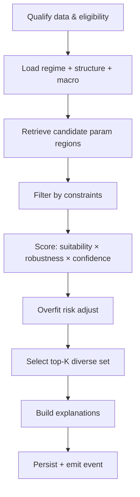
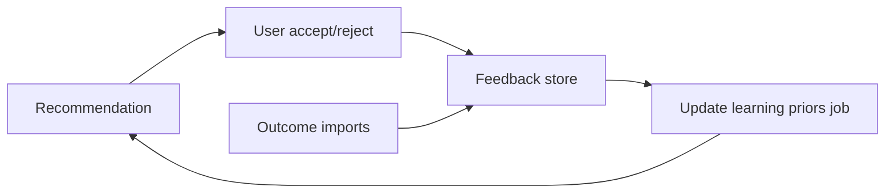

# Recommendation Engine Architecture

## Purpose

Given current market state and historical optimisation memory, produce a **ranked set of robust strategy parameters** with full explanations and explicit overfit risk — suitable for an algorithmic trader’s bot configuration.

This engine does **not** predict next candle direction.

## Inputs

| Input | Source |
|---|---|
| Instrument + timeframe | Catalog / user request |
| Current bars fingerprint | Market Data |
| Structure snapshot | Structure module |
| Regime snapshot | Regime module |
| Macro context | Macro module (optional) |
| Optimisation memory | Prior `OptimisationRun`s + plateaus |
| Constraints | User settings + strategy limits |
| Priors / feedback | Learning tables (optional weight) |

## Outputs

`RecommendationSet` containing top-K `RecommendationItem`s:

- Parameter map
- Suitability score (regime fit)
- Robustness score
- Key metrics snapshot
- `ExplanationDocument`
- `OverfitAssessment`
- Links to supporting runs / plateaus

## Pipeline



## Candidate generation

Candidates come from (priority blend configurable):

1. **Plateaus** from recent eligible optimisation runs for same strategy/instrument/timeframe
2. **Top robust trials** across folds (not raw IS best)
3. **Regime-conditioned subsets** — trials that performed well in windows labeled like *current* regime
4. **Learning priors** — soft preference regions from accepted outcomes (never sole source in v1+)
5. **Strategy defaults** — safe baseline always included as reference item when space allows

## Scoring model

```text
final = w1 * suitability
      + w2 * robustness
      + w3 * evidence_strength
      - w4 * overfit_risk
      - w5 * data_quality_penalty
```

### Suitability

How well the candidate matches **current regime / structure**:

- Historical performance in similar regime segments
- Volatility alignment (e.g. avoid high-sensitivity params in high-vol if constrained)
- Structure concurrence (trend vs range features)

### Robustness

- Plateau stability
- Cross-fold consistency
- Degradation IS→OOS
- Sensitivity (neighbor trial variance)

### Evidence strength

- Amount of supporting history
- Trade count adequacy
- Recency vs staleness of optimisation memory

### Overfit risk

Flags examples:

- Narrow spike vs no plateau
- Large IS/OOS gap
- Extremely sparse trades with outsized profit
- Excessive parameter extremity (at bounds)

High risk does not always delete a candidate; it demotes and surfaces caveats.

## Diversity selection

Top-K is not the five near-identical neighbors of one peak.

Use diversity criteria:

- Distance in parameter space
- Distinct plateau ids
- Optionally distinct risk profiles (conservative vs assertive)

## Explanation builder

For each item, assemble:

1. Regime statement with confidence
2. Why recommended (supporting metrics + plateau)
3. Robustness narrative
4. Caveats / overfit
5. Versus baseline / versus next alternative

Template-generated in v1; LLM may rewrite wording later without changing facts.

## Eligibility gates

Refuse or warn when:

- Insufficient bar history
- No eligible optimisation memory and no defaults policy
- Regime confidence below threshold (return exploratory set with warnings)
- Data quality blocking issues

## Learning loop



Controls:

- Priors versioned and disable-able
- Minimum sample sizes before priors influence ranks
- Periodic regeneration offline job

## API / jobs

- `recommendation.generate` → async job → `RecommendationSet`
- Idempotent regeneration when inputs fingerprint unchanged may return cached set
- `accept` / `reject` write feedback; may export parameter JSON for bot consumption

## Bot export adapters (future multi-broker)

`IParameterExportPort`:

- Generic JSON
- cTrader-specific mapping plugin
- Other bot config writers

Core stores neutral parameter maps.

## Failure modes

| Mode | Behavior |
|---|---|
| Python scorer crash | Job failed; last good set remains queryable |
| Partial macro missing | Continue with `macroConfidence=0` |
| Conflicting runs memory | Prefer newer fingerprint-compatible runs; note conflict in explanation |

## Replaceability

Entire ranking implementation can be swapped if it emits the same `RecommendationSet` contract.  
A/B: `engineVersion` + settings `recommendationProfileId`.

## v1 foundation scope

- Contracts + tables + job skeleton
- Deterministic scorer with simple regime suitability + robustness placeholders
- Explanation templates
- No mandatory trained ML model
