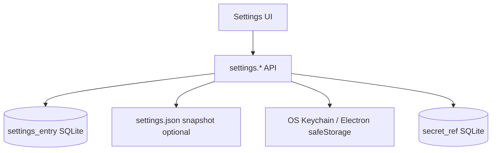

# Settings Storage Design

## Goals

- Separate **preferences**, **engine configuration**, and **secrets**
- Schema-evolve settings safely across app versions
- Support profiles (e.g. conservative vs research recommendation weights)
- Offline-first; cloud sync of non-secret settings later

## Storage tiers



| Tier | What lives there | Examples |
|---|---|---|
| `settings_entry` | Non-secret structured prefs | Theme, default timeframe, job concurrency, metric weights |
| `settings.json` | Optional mirrored export for support | Same as above (no secrets) |
| OS keychain | Secret material | Data vendor API keys, LLM keys, broker tokens |
| `secret_ref` | Pointers only | `provider=keytar`, `account=mia`, `service=openai` |

## Settings schema

Versioned document conceptually:

```text
SettingsRoot
  schemaVersion: number
  general: { locale, theme, startPage }
  workspace: { defaultTimeframe, autosaveInterval }
  engines: {
    pythonWorkers: number
    recommendationProfileId: string
    activeRegimeModelId: string | null
    optimisationDefaults: {...}
  }
  robustness: {
    minTrades: number
    maxIsOosDegradation: number
    preferPlateaus: boolean
  }
  data: {
    gapPolicy: enum
    spikeWarningZ: number
  }
  ui: { chart* , panelLayout }
  plugins: { enabledIds: string[] }
  privacy: { allowCloudLlm: boolean, allowTelemetry: boolean }
  experimental: { flags: Record<string, boolean> }
```

Validation: Zod schema per `schemaVersion` with migrators `vN → vN+1`.

## Profiles

Named overlays for recommendation/optimisation weights:

| Profile | Intent |
|---|---|
| `conservative` | Higher robustness / lower overfit tolerance |
| `balanced` | Default |
| `research` | Allows exploratory candidates with stronger warnings |

Profiles are settings documents, not hard-coded UI branches — engines read `recommendationProfileId`.

## Secret lifecycle

1. User enters secret in UI
2. API stores in keychain; writes `secret_ref`
3. Adapters resolve secret at use-time into memory; never log values
4. Delete secret removes keychain entry + ref
5. Export workspace **excludes** secrets by default

## Access control inside app

- Only `local-api` settings module reads/writes
- Renderer never receives raw secrets after save (only masked status: `configured: true`)

## Sync implications (future)

- Syncable: theme, layouts, non-secret engine prefs, profiles
- Non-syncable: secrets, device paths, absolute import history
- Conflict strategy: LWW per key with device vector clock placeholder on `settings_entry.updated_at` + `device_id`

## Defaults & reset

- Factory defaults in code (`packages/contracts/settingsDefaults`)
- “Reset section” commands
- Doctor tool reports invalid combinations (e.g. workers > CPU)

## Observability

Setting changes emit audit log entries (key + old/new non-secret values) for supportability.
