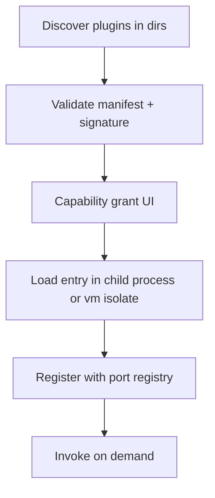

# Plugin Architecture

## Why plugins

Long-term features (brokers, calendar, news, Telegram, TradingView, alternative data, custom evaluators) must expand **without forking the core**. Plugins are capability-declared, version-gated packages loaded by a host in `local-api`.

## Design goals

- Replaceable adapters behind existing ports
- Explicit permissions (filesystem, network, secrets, notifications)
- Stable SPI (`packages/plugin-sdk`)
- Safe failure isolation (plugin crash ≠ app crash)
- First-party and third-party support path

## Plugin manifest

```text
PluginManifest
  id: string                 # reverse-DNS e.g. com.mia.data.csv
  name: string
  version: semver
  apiVersion: string         # host SPI range "^1.0"
  kind: PluginKind[]         # data | macro | broker | notifier | evaluator | llm | uiContribution
  entry: string              # JS module path (Node) and/or python entry ref
  permissions: Permission[]
  markets?: string[]         # optional filter
  configSchema?: JSONSchema
```

## Plugin kinds → ports

| Kind | Port implemented |
|---|---|
| `data` | `IMarketDataPort` |
| `macro` | `IMacroPort` |
| `broker` | `IBrokerPort` |
| `notifier` | `INotifierPort` |
| `evaluator` | `IStrategyEvaluatorPort` |
| `llm` | `ILlmPort` |
| `feature` | `IFeatureContributorPort` |
| `exporterContribution` | Declares React lazy routes/panels via remote or bundled Contrib API (strict review) |

v1 focuses on Node-side plugins; Python feature contributors can register via engine entry points referenced by the manifest.

## Host responsibilities



### Loading strategy

| Stage | Strategy |
|---|---|
| v1 first-party | In-process dynamic import with permission checks |
| Hardening | Child process per plugin + IPC |
| Store third-party | Code signing + sandboxed child process |

Child-process isolation is the **target** commercial posture; architecture must not prevent it (no deep coupling to in-process globals).

## Permissions catalog

Examples:

- `fs.readWorkspace`
- `fs.readUserFile` (dialog-gated)
- `net.fetch` (host allowlist)
- `secrets.get(id)`
- `notify.desktop`
- `notify.telegram`
- `ui.panel`

Denied by default; prompting on enable.

## Port registry

Core modules depend on **interfaces**, resolved to:

1. Built-in implementation
2. Active plugin implementation
3. Composite (e.g. multiple data sources) where supported

Example: `MarketDataService` asks registry for `IMarketDataPort` for a series’ `source_kind`.

## Lifecycle hooks

- `onInstall`, `onEnable`, `onDisable`, `onUninstall`
- `onWorkspaceOpen`
- Health: `ping()` timed

## UI contributions (careful)

Plugins may contribute:

- Import wizards
- Settings sections
- Export formatters

They must use `ui-kit` and declared slots (`slot:recommendations.export`, `slot:settings.providers`).  
No arbitrary DOM injection into chart WebGL context.

## Versioning & compatibility

- Host advertises `pluginApiVersion`
- Manifest `apiVersion` checked with semver range
- Breaking SPI bumps require migration notes

## Security

- Disable `require` of Electron internals
- Network allowlists
- Secrets only via host broker
- Unsigned plugins blocked in production unless developer mode enabled
- Audit log of plugin actions

## First-party plugins planned

| Plugin | Phase |
|---|---|
| `data-csv` | Early |
| `data-stub` (synthetic) | Early testing |
| `notify-desktop` | Mid |
| `macro-calendar` | Mid/Late |
| `broker-ctrader` | Late |
| `notify-telegram` | Late |
| `interop-tradingview` | Late |
| `llm-openai` / `llm-ollama` | Late |

## Testing plugins

- SDK conformance test suite
- Permission denial tests
- Host load/unload leak tests
- Contract tests against sample workspace

## What is not a plugin

- Core regime/recommendation contracts
- SQLite schema
- Job orchestrator
- Electron security shell

Those remain first-party product code with their own module boundaries.
