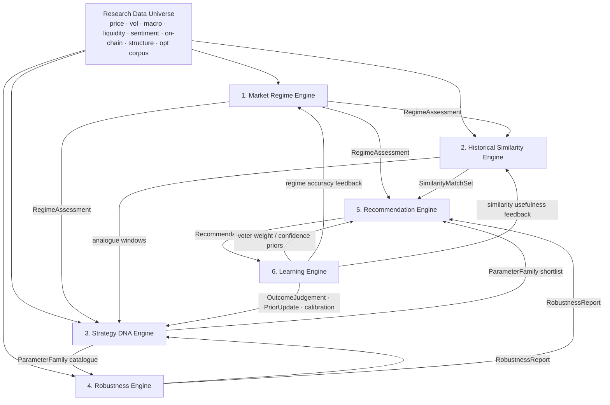
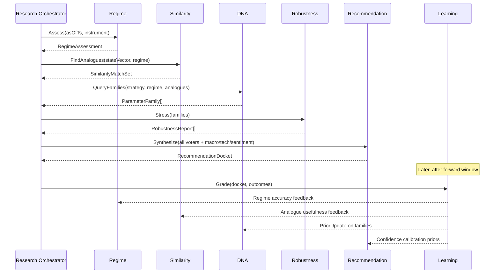

# Quantitative Intelligence Architecture

**Reframe:** Market Intelligence AI is not organised as “an app with screens and jobs.”  
It is organised as a **quantitative research platform** whose purpose is to discover **robust trading parameter recommendations for future market conditions**.

| This product is | This product is not |
|---|---|
| A regime-conditioned research desk | A strategy backtester UI wrapping optimiser clicks |
| A robustness and evidence factory | A peak-equity search engine |
| A parameter-family discovery system | A single-run curve-fit factory |
| A continuously learning recommendation bureau | A crystal ball for next-bar price |

Backtests and optimisation imports are **raw research inputs**.  
The intellectual product is: **given today’s market state, which parameter families are historically most durable for similar conditions — and why.**

---

## 1. Research-platform organisation

Institutional desks separate concerns by **epistemic role**, not by software layer. This architecture mirrors that.

```text
┌──────────────────────────────────────────────────────────────────────────┐
│                     QUANTITATIVE INTELLIGENCE LAYER                      │
│                                                                          │
│  ┌────────────┐  ┌────────────────┐  ┌──────────────┐  ┌─────────────┐ │
│  │  Market    │  │  Historical    │  │  Strategy    │  │ Robustness  │ │
│  │  Regime    │  │  Similarity    │  │  DNA         │  │ Engine      │ │
│  │  Engine    │  │  Engine        │  │  Engine      │  │             │ │
│  └─────┬──────┘  └───────┬────────┘  └──────┬───────┘  └──────┬──────┘ │
│        │                 │                   │                  │        │
│        └────────────┬────┴─────────┬─────────┴──────────┬───────┘        │
│                     ▼              ▼                    ▼                │
│              ┌─────────────────────────────────────────────┐             │
│              │           Recommendation Engine             │             │
│              └──────────────────────┬──────────────────────┘             │
│                                     ▼                                    │
│              ┌─────────────────────────────────────────────┐             │
│              │             Learning Engine                 │             │
│              └─────────────────────────────────────────────┘             │
└──────────────────────────────────────────────────────────────────────────┘
         ▲ evidence / features                              │ grades
         │                                                  ▼
┌────────┴────────┐                              ┌──────────────────────┐
│ Research Data   │                              │ Recommendation Ledger │
│ Universe        │                              │ + Outcome Book        │
└─────────────────┘                              └──────────────────────┘
```

### Desk roles (mapped to engines)

| Research desk role | Engine | Mandate |
|---|---|---|
| Market state desk | Market Regime Engine | Classify *now* with confidence and contested evidence |
| Analogue desk | Historical Similarity Engine | Find prior periods most like *now* |
| Parameter research desk | Strategy DNA Engine | Mine optimisation corpus for durable parameter families |
| Risk / validation desk | Robustness Engine | Stress every family and trial; score fragility |
| Portfolio / allocation desk (params) | Recommendation Engine | Issue only evidence-backed parameter ranges |
| Performance attribution desk | Learning Engine | Grade past recommendations vs reality; update priors |

Software modules (Electron, SQLite, plugins) remain the **delivery chassis**.  
The **research truth** lives in these six engines and their artifacts.

### Research Data Universe (shared substrate)

All engines read from a versioned research universe — never from ad-hoc UI state:

| Domain | Contents |
|---|---|
| Price / structure | OHLCV, swings, levels, range/breakout features |
| Volatility | Realised, implied (when available), vol-of-vol |
| Macro | Calendar intensity, rate path proxies, risk-on/off |
| Correlation | Cross-asset / basket correlation regimes |
| Liquidity | Spread proxies, volume profile, participation |
| Sentiment | Positioning / fear proxies (when available) |
| On-chain | Crypto-specific flows, activity (BTC/ETH); null elsewhere |
| Optimisation corpus | Every imported/generated optimisation run + trials |
| Outcome book | Live / forward performance after recommendations |

Missing domains degrade confidence; they never invent numbers.

---

## 2. Shared research contracts

Engines are **independent**. They communicate only through versioned research objects.

### Core objects

| Object | Meaning |
|---|---|
| `MarketStateVector` | Point-in-time multi-domain feature snapshot for an instrument (and optionally basket) |
| `RegimeAssessment` | Current (or historical) regime classification package |
| `SimilarityMatchSet` | Ranked historical analogues to a query state |
| `ParameterFamily` | A clustered region in parameter space (“DNA strand”) |
| `RobustnessReport` | Multi-test stress verdict for a family or trial |
| `RecommendationDocket` | Issued recommendation with ranges, expectations, evidence graph |
| `OutcomeJudgement` | Post-hoc grade of a docket vs realised market / bot results |
| `EvidenceGraph` | Directed citations: claim → supporting/contradicting facts |

### Non-negotiable law

> **No recommendation may cite a claim without an `EvidenceGraph` node.**  
> Engines may vote “insufficient evidence” and abstain. Abstention is a valid institutional output.

### Identity & versioning

Every research object carries:

- `asOfTs` — decision time (no lookahead)
- `universeFingerprint` — hash of input data slices
- `engineId` + `engineVersion`
- `taxonomyVersion` (for regimes / DNA schemas)
- `seed` when stochastic stages run

Same inputs + versions ⇒ reproducible research outputs.

---

## 3. Engine 1 — Market Regime Engine

### Mandate

Classify the **current market** into an interpretable regime taxonomy, with confidence, supporting evidence, contradicting evidence, and historical frequency.

This desk answers: *“What regime are we in, how sure are we, and what argues against us?”*

### Taxonomy (v1 extensible)

Labels are versioned; the set below is the baseline institutional vocabulary.  
An instrument may carry a **primary regime** plus **secondary overlays** (e.g. primary = Weak Bull, overlay = High Volatility).

| Class | Family | Intent |
|---|---|---|
| Strong Bull | Trend | Persistent directional advance with participation |
| Weak Bull | Trend | Drift higher / soft trend, fragile participation |
| Strong Bear | Trend | Persistent directional decline |
| Range | Mean-reversion / bound | Oscillation between structure bounds |
| Breakout | Transition | Expansion beyond structure with momentum confirmation |
| High Volatility | Vol overlay | Elevated and unstable variance regime |
| Low Volatility | Vol overlay | Compressed variance / quiet market |
| Accumulation | Positioning / structure | Absorbing supply, building base |
| Distribution | Positioning / structure | Supply emerging into strength |
| Capitulation | Stress | Panic selling climax / forced liquidation character |

Taxonomy rules:

- Trend and structure labels may co-exist as primary + overlay when evidence supports both
- Mutual exclusions are declared per taxonomy version (e.g. Strong Bull vs Strong Bear)
- Engines down-rank conflicting labels instead of silently forcing one

### Outputs (`RegimeAssessment`)

| Field | Description |
|---|---|
| `regime` | Primary label |
| `overlays[]` | Optional secondary labels (e.g. High Volatility) |
| `confidence` | Calibrated 0–1 posterior / score |
| `supportingEvidence[]` | Facts that favour the label (features, structure events, macro, vol) |
| `contradictingEvidence[]` | Facts that argue against (must not be empty when confidence is moderate) |
| `historicalFrequency` | How often this regime (and overlay combo) occurred for this instrument / class |
| `transitionHints` | Probable next regimes from historical transition matrix (descriptive, not a trade signal) |
| `stateVectorRef` | Link to `MarketStateVector` used |

### Internal pipeline

```text
MarketStateVector
    → feature specialists (trend, vol, structure, flow)
    → regime classifiers / HMM / rules ensemble
    → conflict arbitration
    → calibration (confidence)
    → frequency tables + transition matrix lookup
    → RegimeAssessment + EvidenceGraph
```

### Independence rules

- Does **not** recommend parameters
- Does **not** score optimisation runs
- May be swapped (rules → ML → ensemble) without changing downstream contracts
- Must remain point-in-time correct (`asOfTs`) for similarity and learning

### Failure / abstention

If features conflict severely or data quality is poor:

- Emit `regime = UNRESOLVED` (or lowest-confidence multi-label set)
- Confidence floors trigger Recommendation Engine caution modes

---

## 4. Engine 2 — Historical Similarity Engine

### Mandate

Find prior historical windows most similar to **today’s** multi-domain market state.  
This desk answers: *“When have we seen conditions like these before?”*

Similarity is not “closest price pattern only.” It is a **multi-factor analogue search**.

### Similarity factors

| Factor | Examples of signals |
|---|---|
| Macro | Event proximity, policy stance proxies, growth/inflation regime tags |
| Volatility | Realised vol level/slope, vol percentile, vol-of-vol |
| Trend | Drift, ADX-like strength, higher-high/lower-low structure stats |
| Correlation | Pair/basket correlation, beta to risk index |
| Liquidity | Volume intensity, participation, gap/slippage proxies |
| Sentiment | Crowding / fear proxies when available |
| On-chain | Active addresses, exchange flows, fee pressure (crypto) |
| Volume | Relative volume, climax/dry-up signatures |
| Structure | Range height, breakout distance, swing density |

Each factor produces a partial distance; missing factors reweight remaining dimensions and **lower match confidence**.

### Outputs (`SimilarityMatchSet`)

For query state `Q` at `asOfTs`:

| Field | Description |
|---|---|
| `matches[]` | Ranked historical windows |
| `match.similarityScore` | 0–1 composite similarity |
| `match.factorScores` | Per-factor contribution breakdown |
| `match.window` | Instrument, start/end, regime labels at that time |
| `match.forwardContext` | What happened *after* the analogue (for research — used carefully downstream) |
| `coverage` | Which factors were available for the query |
| `evidence` | Why these windows ranked high |

Forward context is for **research attribution and recommendation expectations**, not for trivial “it went up next so buy” logic. The Recommendation Engine may use forward distributions of *parameter family performance during/after similar windows*, not raw price direction as a prediction claim.

### Method posture

- Distance metrics in standardised feature space (Mahalanobis / cosine / learned metric — replaceable)
- Regime-aware blocking: optional prefer matches with similar primary regime
- Liquidity & asset-class filters: do not analogue BTC crash exclusively to EURUSD sessions unless explicitly cross-asset mode is on
- Anti-lookahead: features for historical window end at window end

### Independence rules

- Does not classify regimes (consumes RegimeAssessment as a feature / filter)
- Does not mine DNA
- May return empty set with `insufficientCoverage`

---

## 5. Engine 3 — Strategy DNA Engine

### Mandate

**Core IP.** Analyse the entire optimisation corpus ever imported or generated.  
Discover **parameter families** that consistently survive across multiple market regimes — not the single highest-profit trial.

This desk answers: *“Which genetic strands of parameters keep working when the market changes character?”*

### What “DNA” means

A `ParameterFamily` is a **stable cluster / plateau region** in parameter space, expressed as ranges (and optional discrete alleles), for a given strategy genotype:

```text
Example family (illustrative):
  EMA fast:        9 – 12
  ATR stop mult:   1.0 – 1.3
  Risk:Reward:     2.0 – 2.5
  Robustness:      0.81
  Fragility flags: none
  Regime coverage: Weak Bull, Range, Low Volatility
```

Families are first-class research objects — richer than “best trial #4821.”

### Corpus inputs

- All optimisation runs (external imports + internal)
- Trial metrics, folds, constraints
- Regime labels overlapping each trial’s evaluation windows
- Prior RobustnessReports (when available)
- OutcomeJudgements linked to families (from Learning Engine)

### Discovery pipeline

```text
Optimisation corpus
    → normalise parameter schemas per strategy
    → density / clustering / plateau extraction
    → cross-run consolidation (same strategy DNA across imports)
    → regime-conditioned survival scoring
    → fragility & overfit detectors
    → ParameterFamily catalogue + robustness priors
```

### Scoring a family (DNA-native)

| Signal | Meaning |
|---|---|
| Cross-regime survival | Performance holds across multiple regime labels |
| Cross-run recurrence | Appears in independent optimisation imports/seeds |
| Plateau width | Neighbors remain acceptable (not a needle peak) |
| Metric balance | Expectancy / DD / trade count / consistency cohere |
| Bound extremity | Families living only at search boundaries are suspect |
| Complexity | Unnecessarily tight multi-parameter locks penalised |

**Highest total profit is never the primary ranking key.**

### Outputs

| Object | Contents |
|---|---|
| `ParameterFamily` | Ranges, center, strategy id, allele discrete sets |
| `family.robustnessScore` | DNA-estimated durability (refined later by Robustness Engine) |
| `family.regimeLedger` | Per-regime performance / survival stats |
| `family.fragileCombinations[]` | Known toxic corners nearby |
| `family.overfitRisk` | Needle peaks, IS/OOS cliffs, sparse-trade miracles |
| `family.supportingRunRefs` | Evidence from corpus |

### Fragile combination detection

Examples of fragility signatures:

- Tiny basin of attraction (one step left/right collapses metrics)
- Excellent IS, collapsed OOS / walk-forward
- Works in only one rare regime with tiny sample
- Dominated by a handful of outlier trades
- Extremely high profit factor with tiny trade count

### Independence rules

- Does **not** decide what to trade *today* (Recommendation Engine does)
- Does **not** require current regime to maintain the DNA catalogue (regime conditions the catalogue views)
- Recompute jobs can be scheduled after corpus imports

---

## 6. Engine 4 — Robustness Engine

### Mandate

Subject candidate trials and parameter families to institutional stress tests.  
Return a **robustness score** and a structured failure profile.

This desk answers: *“If we take this DNA into live uncertainty, how likely is it to survive?”*

### Test battery

| Test | Question asked |
|---|---|
| Walk Forward | Does performance hold across sequential train/test folds? |
| Monte Carlo | How sensitive are equity / DD paths to trade-order and noise resampling? |
| Parameter Stability | Do neighbors in parameter space remain acceptable? |
| Sensitivity Analysis | Which parameters dominate variance of outcomes? |
| Drawdown Stability | Are DD depth/duration distributions acceptable under stress? |
| Trade Distribution | Are results dependent on a few outliers or regimes of trades? |
| Consistency | Are returns / expectancy stable across time buckets and regimes? |
| Noise Resistance | Do small bar perturbations / execution noise destroy edge? |

Each test emits a subscore + diagnostics. The composite `robustnessScore` is a transparent weighted aggregation with published weights per profile (conservative / balanced / research).

### Outputs (`RobustnessReport`)

| Field | Description |
|---|---|
| `subject` | Trial id and/or `ParameterFamily` id |
| `robustnessScore` | 0–1 composite |
| `subscores` | Map of test → score |
| `drawdownProfile` | Expected / stressed DD bands |
| `fragilityFlags[]` | Machine-readable failure tags |
| `passFailGates` | Hard institutional gates (min trades, max IS→OOS cliff, …) |
| `evidence` | Artifact refs (MC paths summary, WF table, sensitivity tornado) |

### Gates vs scores

- **Gates** reject subjects for recommendation eligibility
- **Scores** rank eligible subjects
- A beautiful equity curve that fails gates never enters the Recommendation Engine as a primary candidate

### Independence rules

- Pure evaluator; does not invent families
- Can be run on DNA families, individual trials, or recommendation candidates
- Stochastic tests record seeds for audit

---

## 7. Engine 5 — Recommendation Engine

### Mandate

Combine the research desk outputs into **parameter range recommendations** for **future** conditions under the current regime and its analogues.

This desk answers: *“Given everything we know, what robust ranges should the bot use now — and what outcomes should we expect if history rhymes?”*

### Required inputs (voting)

| Source | Contribution |
|---|---|
| Market Regime Engine | Current regime + confidence + conflicts |
| Historical Similarity Engine | Analogue windows + factor coverage |
| Strategy DNA Engine | Candidate families + regime survival ledgers |
| Robustness Engine | Stress-qualified scores / gates |
| Macro | Event risk overlays (widen caution near major events) |
| Technical / structure | Structure alignment filters |
| Sentiment | Positioning extremes as risk modifiers |
| Learning Engine priors | Historical accuracy of similar past dockets |

If any critical voter abstains (e.g. no DNA for strategy, unresolved regime, failed robustness gates), the engine issues:

- `NO_RECOMMENDATION` or
- `CAUTIONARY_RECOMMENDATION` with reduced confidence and explicit gaps

**Never recommend parameters without evidence.**

### Outputs (`RecommendationDocket`)

| Field | Description |
|---|---|
| `parameterRanges` | Recommended family ranges (not a single curve-fit point by default) |
| `pointEstimate` | Optional center for bot convenience (always linked to ranges) |
| `expectedDrawdown` | Range / distributional expectation from analogues + robustness |
| `expectedWinRate` | Evidence-backed expectation band |
| `expectedProfitFactor` | Evidence-backed expectation band |
| `confidence` | Joint confidence (regime × coverage × robustness × sample size) |
| `reasoning` | Ordered narrative + `EvidenceGraph` |
| `regimeContext` | Primary/overlay regimes |
| `analogueRefs` | Similarity matches used |
| `dnaFamilyRefs` | Families selected |
| `robustnessRefs` | Reports used |
| `caveats[]` | Contradictions, macro event risks, data gaps |
| `invalidWithout` | List of evidence ids that, if revoked, void the docket |

Expectations are **conditional research estimates** from historical analogues and stressed distributions — not promises.

### Synthesis logic (conceptual)

```text
1. Require RegimeAssessment (or explicit UNRESOLVED handling)
2. Pull SimilarityMatchSet; measure coverage
3. Query Strategy DNA families filtered by regime survival + analogue performance
4. Submit shortlist to Robustness Engine (or reuse fresh reports)
5. Apply macro/technical/sentiment modifiers (usually caution, rarely aggression)
6. Apply Learning Engine priors (shrink confidence when past similar dockets failed)
7. Select diversified top-K families (not clones of one peak)
8. Emit RecommendationDocket with full EvidenceGraph
```

### Anti-patterns forbidden

- Recommending the max-profit trial of the latest optimisation alone
- Emitting a single parameter point with no range and no plateau/DNA support
- Hiding contradicting regime evidence
- Using future bars relative to `asOfTs`

---

## 8. Engine 6 — Learning Engine

### Mandate

Close the research loop. Compare every issued recommendation to **subsequent actual market / bot performance**. Become smarter without silently overfitting to last month’s luck.

This desk answers: *“Where were we right, where wrong, and how should future dockets change?”*

### What is tracked

| Track | Meaning |
|---|---|
| Recommendation accuracy | Did realised metrics fall within expected bands? |
| Prediction confidence calibration | Were 70% confidence dockets right ~70% of the time? |
| Parameter performance | How did accepted families perform forward? |
| Market regime accuracy | Did ex-post labels agree with ex-ante RegimeAssessment? |
| Similarity usefulness | Did high-similarity analogues forecast family performance? |
| Robustness predictive power | Did low robustness scores predict forward failure? |

### Outputs

| Object | Role |
|---|---|
| `OutcomeJudgement` | Per-docket grade + error decomposition |
| `CalibrationReport` | Reliability diagrams for confidence |
| `PriorUpdate` | Soft updates to DNA weights / engine voter weights |
| `TaxonomyFeedback` | Regime confusion matrix → taxonomy/model improvement queue |

### Learning rules (institutional hygiene)

1. **No automatic overwrite of DNA by a single lucky week** — Bayesian / shrinkage updates with minimum sample sizes  
2. **Separate labels:** user accept/reject ≠ market correctness  
3. **Point-in-time judgements** — outcomes graded only on data after `asOfTs`  
4. **Champion/challenger** — prior sets versioned; can disable learning influence  
5. **Auditability** — every weight change cites OutcomeJudgement ids  

### Continuous improvement loop

```text
RecommendationDocket
    → time passes / bot results imported
    → OutcomeJudgement
    → calibration + attribution
    → PriorUpdate (optional, gated)
    → influences future DNA ranking & Recommendation voter weights
    → improves Regime / Similarity models via offline retrain jobs
```

---

## 9. Engine communication diagram

### Research dataflow (primary)



### Control plane (orchestration)



### Independence matrix

| Engine | May call directly | Must not own |
|---|---|---|
| Regime | Research universe | Parameter advice |
| Similarity | Universe + RegimeAssessment | DNA mining |
| DNA | Universe + regimes + optional robustness + learning priors | Final user-facing docket |
| Robustness | Trials/families + bars | Regime labeling |
| Recommendation | All voter outputs | Silent mutation of DNA without Learning |
| Learning | Docket ledger + outcomes | Live parameter push without Recommendation |

Communication is **asynchronous and artifact-based**. Engines publish objects to the research ledger; orchestrator composes them. This keeps each engine replaceable like a desk swapping a model vendor.

---

## 10. Evidence & abstention policy

| Situation | Required behavior |
|---|---|
| Regime contradictions high | Recommendation confidence capped; caveats mandatory |
| Similarity coverage thin | Widen uncertainty bands or abstain |
| DNA catalogue empty | No primary recommendation |
| Robustness gates fail | Family ineligible |
| Macro event cluster imminent | Caution modifier; possibly widen expected DD |
| Learning marks recent failure of similar dockets | Shrink size of claims / confidence |

**Abstention is a first-class product output**, not an error dialog.

---

## 11. Mapping to prior architecture docs

This document **re-centers product meaning**. Earlier docs remain the delivery chassis:

| Prior doc | Relationship |
|---|---|
| `01-system-architecture.md` | Process/hexagonal shell; intelligence layer sits as domain core |
| `08-ai-architecture.md` | Implementation techniques under these engines (L1/L2/L3) |
| `10-optimisation-engine.md` | Becomes a **corpus producer / importer**, not the product goal |
| `11-recommendation-engine.md` | Superseded in *intent* by Engine 5 here; implement to this contract |
| Optimisation UI | Research laboratory tooling, subordinate to DNA + Robustness |

**Architectural postulate going forward:**

> Optimisation without Regime + Similarity + DNA + Robustness + Learning is incomplete research.  
> The product’s north star artifact is the `RecommendationDocket`, not an equity curve.

---

## 12. Quantitative quality bars (definition of serious)

A release may claim “quantitative intelligence” only if:

1. Every docket has a complete EvidenceGraph  
2. Parameter output prefers **ranges / families** over lone peaks  
3. Robustness battery results are visible before accept  
4. Regime assessments show supporting **and** contradicting evidence  
5. Similarity factor coverage is disclosed  
6. Learning calibration reports exist for prior dockets  
7. Peak profit never outranks robustness gates in eligibility  

---

## 13. v1 research scope vs later

| Capability | Foundation | Later deepening |
|---|---|---|
| Regime taxonomy + evidence | Yes | Richer ML ensembles, better calibration |
| Similarity multi-factor | Core factors available offline | Sentiment / on-chain / full macro |
| DNA clustering from imports | Yes | Cross-strategy genotypes, auto schema align |
| Robustness battery | WF + stability first; MC/noise staged | Full institutional battery default-on |
| Recommendation dockets | Yes | Portfolio-aware multi-instrument dockets |
| Learning loop | Ledger + manual outcome import | Automated bot outcome feeds + prior updates |

No application code is specified here — only the **research organisation, contracts, and engine mandates** required before Phase 1 scaffolding aligns to this layer.
