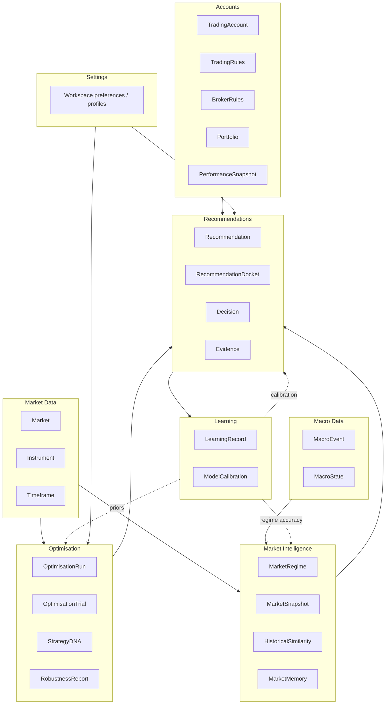

# Domain Model

**Ubiquitous language for Market Intelligence AI.**

This document is the **canonical vocabulary** of the platform. Every module, engine, API contract, database projection, UI label, and future plugin **must** use these names and meanings consistently.

> **Core principle:** Think like a quantitative hedge fund.  
> The domain revolves around **evidence**, **market regimes**, **optimisation corpora**, **robustness**, and **recommendations**.  
> Do **not** model this product as a CRUD catalogue of unrelated tables.

**Related architecture**

- Research organisation: [16-quantitative-intelligence-architecture.md](16-quantitative-intelligence-architecture.md)
- Persistence sketch: [04-database-design.md](04-database-design.md) / [05-entity-relationship.md](05-entity-relationship.md)
- Chassis: [01-system-architecture.md](01-system-architecture.md)

No implementation code is specified here — only domain meaning, structure, and rules.

---

## 0. Modelling laws

1. **Evidence before assertion** — Any claim attached to a `Recommendation`, `MarketRegime`, `StrategyDNA`, or `Decision` must reference `Evidence`.
2. **Point-in-time correctness** — Snapshots and judgements carry `asOf` (`Instant`). No silent lookahead.
3. **Ranges over needles** — Prefer `ParameterRange` / `StrategyDNA` families over single lucky `ParameterSet` peaks.
4. **Abstention is valid** — Domain services may refuse to decide; that is not an infrastructure error.
5. **Stable identity, replaceable algorithms** — Entities survive model/broker/engine swaps; algorithms are adapters behind services.
6. **Version everything scientific** — Taxonomy, engine, schema, and universe fingerprints travel with research objects.
7. **Bounded context purity** — Cross-context collaboration uses published domain events and IDs, not foreign writes into another aggregate’s internals.

### Identity conventions

| Kind | Rule |
|---|---|
| Entity / Aggregate IDs | Opaque ULID/UUID strings (`id`) |
| External codes | `symbol`, `brokerCode`, provider keys — never used as primary identity |
| Version fields | `schemaVersion`, `taxonomyVersion`, `engineVersion` |
| Fingerprints | `universeFingerprint` hashes input data slices |

### Nullability of research domains

Sentiment, on-chain, implied vol, etc. may be **unavailable**. Absence lowers `Confidence` / coverage — it must not invent defaults that look like facts.

---

## 1. Bounded contexts



| Context | Responsibility | Publishes | Consumes |
|---|---|---|---|
| **Market Data** | Canonical markets, instruments, timeframes, series identity | `MarketUpdated` | Ingest adapters |
| **Macro Data** | Economic calendar & aggregate macro state | `EconomicEventReleased` | Calendar providers |
| **Market Intelligence** | Snapshots, regimes, similarity, memory | `MarketRegimeChanged`, `HistoricalMatchFound` | Market Data, Macro, sentiment/on-chain/liquidity projections |
| **Optimisation** | Runs, trials, DNA, robustness reports | `OptimisationImported`, `OptimisationCompleted`, `StrategyDNAUpdated` | Market Data |
| **Recommendations** | Dockets, recommendations, decisions, evidence assembly | `RecommendationGenerated`, `RecommendationAccepted`, `RecommendationRejected` | Intelligence, Optimisation, Accounts, Settings |
| **Learning** | Outcome grades, calibration | `LearningUpdated`, `ConfidenceRecalibrated` | Recommendations, Accounts performance |
| **Accounts** | Trading accounts, rules, portfolio, performance | Performance-related events (later) | Brokers |
| **Settings** | Profiles, risk appetites, engine toggles | Settings-changed (platform) | All readers |

**Cross-context rule:** Recommendation context never mutates `OptimisationTrial` rows; it references IDs. Learning never silently rewrites DNA ranges — it emits priors consumed by Strategy DNA Service.

---

## 2. Value objects

Reusable, immutable meanings. Equal by value. No identity.

### Percentage

| | |
|---|---|
| **Purpose** | Ratio expressed in percent terms for display-consistent math |
| **Attributes** | `value: number` (e.g. `12.5` means 12.5%) |
| **Validation** | Finite; contextual bounds enforced by owner (win rate 0–100, etc.) |
| **Example** | `{ "value": 54.2, "unit": "percent" }` |

### Probability

| | |
|---|---|
| **Purpose** | Likelihood in \[0, 1\] |
| **Attributes** | `value: number` |
| **Validation** | `0 <= value <= 1` |
| **Example** | `{ "value": 0.73 }` |

### Confidence / ConfidenceScore

| | |
|---|---|
| **Purpose** | Calibrated belief in an assessment or recommendation |
| **Attributes** | `value: Probability`, `method: string`, `calibrationRef?: id` |
| **Validation** | Value in \[0,1\]; method required (`ensemble_v1`, `heuristic`, …) |
| **Example** | `{ "value": 0.68, "method": "regime_ensemble_v1" }` |

### Risk / RiskProfile (value view)

`Risk` as scalar and structured `RiskProfile`:

| | |
|---|---|
| **Purpose** | Express risk appetite or measured risk level |
| **Attributes (Risk)** | `level: "low"|"moderate"|"high"|"extreme"`, `score?: Score` |
| **Attributes (RiskProfile)** | `maxDrawdown: Drawdown`, `riskPerTrade?: Percentage`, `maxOpenRisk?: Percentage`, `leverageCap?: number`, `notes?: string` |
| **Example** | `{ "maxDrawdown": { "value": 0.12, "kind": "fraction" }, "riskPerTrade": { "value": 1.0 }, "leverageCap": 1 }` |

### Price

| | |
|---|---|
| **Purpose** | Instrument price in quote terms |
| **Attributes** | `value: number`, `currency?: string`, `scale?: number` |
| **Validation** | Finite; `value > 0` for most spot markets |
| **Example** | `{ "value": 68450.5, "currency": "USD" }` |

### ATR

| | |
|---|---|
| **Purpose** | Average True Range (volatility distance) |
| **Attributes** | `value: number`, `period: number`, `priceUnit: "absolute"|"percent"` |
| **Example** | `{ "value": 1250.0, "period": 14, "priceUnit": "absolute" }` |

### Drawdown

| | |
|---|---|
| **Purpose** | Peak-to-trough loss measure |
| **Attributes** | `value: number`, `kind: "fraction"|"percent"`, `durationBars?: number` |
| **Validation** | Non-negative magnitude |
| **Example** | `{ "value": 0.18, "kind": "fraction", "durationBars": 42 }` |

### ProfitFactor

| | |
|---|---|
| **Purpose** | Gross profit / gross loss |
| **Attributes** | `value: number` (`null` if undefined / zero loss) |
| **Validation** | `value >= 0` when present |
| **Example** | `{ "value": 1.74 }` |

### SharpeRatio

| | |
|---|---|
| **Purpose** | Risk-adjusted return summary (definition versioned) |
| **Attributes** | `value: number`, `definition: string` (e.g. `daily_rf0_v1`) |
| **Example** | `{ "value": 1.21, "definition": "daily_rf0_v1" }` |

### DateRange

| | |
|---|---|
| **Purpose** | Half-open or closed research window |
| **Attributes** | `start: Instant`, `end: Instant`, `inclusivity: "closed"|"startClosedEndOpen"` |
| **Validation** | `start < end` (or `<=` if policy allows zero-length forbiddance) |
| **Example** | `{ "start": "2022-06-01T00:00:00Z", "end": "2022-09-01T00:00:00Z", "inclusivity": "startClosedEndOpen" }` |

### ParameterRange

| | |
|---|---|
| **Purpose** | Durable interval for one strategy parameter (DNA strand allele) |
| **Attributes** | `name: string`, `min: number|string`, `max: number|string`, `step?: number`, `unit?: string`, `type: "int"|"float"|"enum"` |
| **Validation** | `min <= max` for numeric; enum ranges list allowed values |
| **Example** | `{ "name": "emaFast", "type": "int", "min": 9, "max": 12, "step": 1 }` |

### Score

| | |
|---|---|
| **Purpose** | Normalised ranking / quality measure |
| **Attributes** | `value: number`, `scale: "0_1"|"unbounded"`, `direction: "higherBetter"|"lowerBetter"` |
| **Example** | `{ "value": 0.81, "scale": "0_1", "direction": "higherBetter" }` |

### Instant / InstantRef (implicit)

ISO-8601 UTC timestamps used everywhere as `asOf`, `createdAt`, bar times.

### Money (supporting)

Optional for account/performance contexts: `{ "amount": number, "currency": "USD" }`.

---

## 3. Core domain objects

For each object: Purpose · Responsibilities · Attributes · Relationships · Lifecycle · Validation · Ownership · Dependencies · Example JSON.

---

### 3.1 Market

| | |
|---|---|
| **Purpose** | Tradable universe entry abstracting venue and product class (FX, crypto, metal, index, …). |
| **Responsibilities** | Identify a market conceptually; group instruments; carry asset-class policies. |
| **Attributes** | `id`, `code` (e.g. `CRYPTO_SPOT`), `name`, `assetClass`, `sessionCalendarId?`, `isActive`, `metadata` |
| **Relationships** | 1→N `Instrument` |
| **Lifecycle** | Created in catalog → activated/deactivated → rarely archived |
| **Validation** | Unique `code`; known `assetClass` enum |
| **Ownership** | Market Data context |
| **Dependencies** | None (root catalog concept) |

```json
{
  "id": "mkt_crypto_spot",
  "code": "CRYPTO_SPOT",
  "name": "Crypto Spot",
  "assetClass": "crypto",
  "isActive": true
}
```

---

### 3.2 Instrument

| | |
|---|---|
| **Purpose** | Canonical symbol under research (e.g. BTCUSD). |
| **Responsibilities** | Stable identity for all snapshots, regimes, DNA, recommendations. |
| **Attributes** | `id`, `marketId`, `symbol`, `displayName`, `baseCode?`, `quoteCode?`, `tickSize?`, `pointValue?`, `providerMappings[]`, `isActive` |
| **Relationships** | N→1 `Market`; used by nearly all research objects |
| **Lifecycle** | Seeded → mapped to providers → deactivated (soft) if retired |
| **Validation** | Unique `symbol` per workspace policy; `marketId` required |
| **Ownership** | Market Data |
| **Dependencies** | `Market` |

```json
{
  "id": "inst_btcusd",
  "marketId": "mkt_crypto_spot",
  "symbol": "BTCUSD",
  "displayName": "Bitcoin / USD",
  "baseCode": "BTC",
  "quoteCode": "USD",
  "isActive": true,
  "providerMappings": [{ "provider": "csv", "code": "BTCUSD" }]
}
```

---

### 3.3 Timeframe

| | |
|---|---|
| **Purpose** | Canonical bar resolution for analysis. |
| **Responsibilities** | Normalise M1…D1 (and custom) across engines. |
| **Attributes** | `id`, `code` (`H1`), `minutes`, `isStandard` |
| **Relationships** | Referenced by snapshots, runs, recommendations |
| **Lifecycle** | Static catalog + optional custom entries |
| **Validation** | `minutes > 0`; unique `code` |
| **Ownership** | Market Data |
| **Dependencies** | None |

```json
{ "id": "tf_h1", "code": "H1", "minutes": 60, "isStandard": true }
```

---

### 3.4 MarketSnapshot

| | |
|---|---|
| **Purpose** | Point-in-time multi-domain state of an instrument (research universe slice). |
| **Responsibilities** | Bundle technical, macro, sentiment, on-chain, liquidity, correlation refs into one `asOf` package; compute `universeFingerprint`. |
| **Attributes** | `id`, `instrumentId`, `timeframeId`, `asOf`, `universeFingerprint`, `technicalRef?`, `macroStateRef?`, `sentimentRef?`, `onChainRef?`, `liquidityRef?`, `correlationRef?`, `regimeRef?`, `coverage` |
| **Relationships** | Composes domain snapshots; input to Regime / Similarity |
| **Lifecycle** | Computed → immutable → superseded by newer `asOf` |
| **Validation** | At least one domain slice present; `asOf` required |
| **Ownership** | Market Intelligence |
| **Dependencies** | Instrument, Timeframe, child snapshots |

```json
{
  "id": "snap_btcusd_h1_2026-07-14T16:00:00Z",
  "instrumentId": "inst_btcusd",
  "timeframeId": "tf_h1",
  "asOf": "2026-07-14T16:00:00Z",
  "universeFingerprint": "fp_9a2c…",
  "technicalRef": "tech_…",
  "macroStateRef": "macros_…",
  "liquidityRef": "liq_…",
  "coverage": { "technical": true, "macro": true, "sentiment": false, "onChain": true }
}
```

---

### 3.5 MarketRegime

| | |
|---|---|
| **Purpose** | Classification of market character at `asOf`. |
| **Responsibilities** | Hold primary label + overlays, confidence, supporting/contradicting evidence, historical frequency. |
| **Attributes** | `id`, `instrumentId`, `timeframeId`, `asOf`, `primary` (enum), `overlays[]`, `confidence: ConfidenceScore`, `supportingEvidenceIds[]`, `contradictingEvidenceIds[]`, `historicalFrequency: Probability`, `transitionHints[]`, `taxonomyVersion`, `engineVersion`, `snapshotId` |
| **Relationships** | N→1 `MarketSnapshot`; Evidence N; used by Similarity, DNA views, Recommendation |
| **Lifecycle** | Assessed → superseded; historical regimes retained as timeline |
| **Validation** | Primary in taxonomy; cannot be Strong Bull and Strong Bear simultaneously (taxonomy rules); evidence lists required when confidence mid-range |
| **Ownership** | Market Intelligence |
| **Dependencies** | MarketSnapshot, Evidence, taxonomy |

```json
{
  "id": "reg_…",
  "instrumentId": "inst_btcusd",
  "timeframeId": "tf_h1",
  "asOf": "2026-07-14T16:00:00Z",
  "primary": "WeakBull",
  "overlays": ["HighVolatility"],
  "confidence": { "value": 0.64, "method": "regime_ensemble_v1" },
  "supportingEvidenceIds": ["ev_trend_…", "ev_struct_…"],
  "contradictingEvidenceIds": ["ev_vol_spike_…"],
  "historicalFrequency": { "value": 0.18 },
  "taxonomyVersion": "regime_tax_v1",
  "engineVersion": "regime_eng_0.3.0",
  "snapshotId": "snap_…"
}
```

**Taxonomy enum (v1):** `StrongBull`, `WeakBull`, `StrongBear`, `Range`, `Breakout`, `HighVolatility`, `LowVolatility`, `Accumulation`, `Distribution`, `Capitulation`, `Unresolved`.

---

### 3.6 MacroEvent

| | |
|---|---|
| **Purpose** | Discrete economic/news calendar event. |
| **Responsibilities** | Represent scheduled or released macro information affecting risk caution. |
| **Attributes** | `id`, `code`, `title`, `country?`, `category`, `scheduledAt`, `releasedAt?`, `importance: "low"|"medium"|"high"`, `actual?`, `forecast?`, `previous?`, `source` |
| **Relationships** | Feeds `MacroState`; may attach Evidence |
| **Lifecycle** | Scheduled → released → archived |
| **Validation** | `scheduledAt` required for calendar events |
| **Ownership** | Macro Data |
| **Dependencies** | Provider adapters |

```json
{
  "id": "me_cpi_us_…",
  "code": "US_CPI_YoY",
  "title": "US CPI YoY",
  "country": "US",
  "category": "inflation",
  "scheduledAt": "2026-07-15T12:30:00Z",
  "importance": "high",
  "source": "calendar_plugin_v1"
}
```

---

### 3.7 MacroState

| | |
|---|---|
| **Purpose** | Aggregated macro backdrop at `asOf` for an instrument or global risk lens. |
| **Responsibilities** | Summarise event proximity, risk-on/off, policy stance proxies. |
| **Attributes** | `id`, `asOf`, `scope` (`global`\|`instrument`), `instrumentId?`, `riskStance`, `eventPressure: Score`, `nearbyEventIds[]`, `features`, `fingerprint` |
| **Relationships** | MacroEvents; included in MarketSnapshot |
| **Lifecycle** | Computed → immutable |
| **Validation** | Scope rules: instrument scope requires `instrumentId` |
| **Ownership** | Macro Data / consumed by Market Intelligence |
| **Dependencies** | MacroEvent |

```json
{
  "id": "macros_…",
  "asOf": "2026-07-14T16:00:00Z",
  "scope": "global",
  "riskStance": "risk_off_bias",
  "eventPressure": { "value": 0.7, "scale": "0_1", "direction": "higherBetter" },
  "nearbyEventIds": ["me_cpi_us_…"]
}
```

---

### 3.8 SentimentSnapshot

| | |
|---|---|
| **Purpose** | Point-in-time crowding / fear / positioning measure. |
| **Attributes** | `id`, `instrumentId?`, `asOf`, `source`, `score: Score`, `label?`, `features`, `available: boolean` |
| **Relationships** | MarketSnapshot |
| **Lifecycle** | Computed/imported → immutable |
| **Validation** | If `available=false`, score may be null |
| **Ownership** | Market Intelligence (projection) |
| **Dependencies** | Optional sentiment providers |

```json
{
  "id": "sent_…",
  "instrumentId": "inst_btcusd",
  "asOf": "2026-07-14T16:00:00Z",
  "source": "stub",
  "available": false,
  "score": null
}
```

---

### 3.9 TechnicalSnapshot

| | |
|---|---|
| **Purpose** | Technical & market-structure feature bundle at `asOf`. |
| **Attributes** | `id`, `instrumentId`, `timeframeId`, `asOf`, `trendStrength`, `structureState`, `volatilityState`, `atr?: ATR`, `levels[]`, `features`, `fingerprint` |
| **Relationships** | MarketSnapshot; Evidence source |
| **Lifecycle** | Computed → immutable |
| **Validation** | Instrument + timeframe + asOf required |
| **Ownership** | Market Intelligence |
| **Dependencies** | Market Data series |

```json
{
  "id": "tech_…",
  "instrumentId": "inst_btcusd",
  "timeframeId": "tf_h1",
  "asOf": "2026-07-14T16:00:00Z",
  "trendStrength": { "value": 0.42, "scale": "0_1", "direction": "higherBetter" },
  "structureState": "higher_lows",
  "volatilityState": "elevated",
  "atr": { "value": 480.0, "period": 14, "priceUnit": "absolute" }
}
```

---

### 3.10 OnChainSnapshot

| | |
|---|---|
| **Purpose** | Crypto on-chain activity/flow snapshot (null for FX/indices). |
| **Attributes** | `id`, `instrumentId`, `asOf`, `available`, `exchangeNetFlow?`, `activeAddresses?`, `feePressure?`, `features`, `source` |
| **Relationships** | MarketSnapshot |
| **Lifecycle** | Imported/computed → immutable |
| **Validation** | Non-crypto instruments should set `available=false` |
| **Ownership** | Market Intelligence |
| **Dependencies** | On-chain providers |

```json
{
  "id": "oc_…",
  "instrumentId": "inst_btcusd",
  "asOf": "2026-07-14T16:00:00Z",
  "available": true,
  "exchangeNetFlow": -1250.5,
  "source": "onchain_plugin_v1"
}
```

---

### 3.11 LiquiditySnapshot

| | |
|---|---|
| **Purpose** | Liquidity / participation conditions. |
| **Attributes** | `id`, `instrumentId`, `asOf`, `relativeVolume: Score`, `spreadProxy?`, `participation?`, `features` |
| **Relationships** | MarketSnapshot; Similarity factor |
| **Ownership** | Market Intelligence |
| **Dependencies** | Volume/tick data |

```json
{
  "id": "liq_…",
  "instrumentId": "inst_btcusd",
  "asOf": "2026-07-14T16:00:00Z",
  "relativeVolume": { "value": 1.35, "scale": "unbounded", "direction": "higherBetter" }
}
```

---

### 3.12 CorrelationSnapshot

| | |
|---|---|
| **Purpose** | Cross-asset correlation state for an instrument vs basket. |
| **Attributes** | `id`, `instrumentId`, `asOf`, `basketCode`, `pairwise[]`, `avgCorrelation`, `regimeTag?` |
| **Relationships** | MarketSnapshot; Similarity |
| **Ownership** | Market Intelligence |
| **Dependencies** | Multi-instrument series |

```json
{
  "id": "corr_…",
  "instrumentId": "inst_btcusd",
  "asOf": "2026-07-14T16:00:00Z",
  "basketCode": "RISK_ASSETS_V1",
  "avgCorrelation": 0.62,
  "pairwise": [{ "vsInstrumentId": "inst_ethusd", "value": 0.81 }]
}
```

---

### 3.13 HistoricalEpisode

| | |
|---|---|
| **Purpose** | A historical window treated as a comparable market episode. |
| **Responsibilities** | Anchor analogues; store regime mix and fingerprint for that window. |
| **Attributes** | `id`, `instrumentId`, `timeframeId`, `range: DateRange`, `regimeSummary`, `snapshotFingerprint`, `labels[]` |
| **Relationships** | Used by `HistoricalSimilarity` matches |
| **Lifecycle** | Indexed → referenced → retained |
| **Validation** | Range valid; episode length within policy bounds |
| **Ownership** | Market Intelligence |
| **Dependencies** | Instrument, Timeframe, historical snapshots/regimes |

```json
{
  "id": "ep_…",
  "instrumentId": "inst_btcusd",
  "timeframeId": "tf_h1",
  "range": {
    "start": "2022-05-01T00:00:00Z",
    "end": "2022-05-20T00:00:00Z",
    "inclusivity": "startClosedEndOpen"
  },
  "regimeSummary": { "primary": "Capitulation", "overlays": ["HighVolatility"] },
  "labels": ["luna_aftermath"]
}
```

---

### 3.14 HistoricalSimilarity

| | |
|---|---|
| **Purpose** | Ranked set of historical episodes similar to a query snapshot. |
| **Responsibilities** | Multi-factor similarity scoring and coverage disclosure. |
| **Attributes** | `id`, `querySnapshotId`, `asOf`, `matches[]` (`episodeId`, `similarity: Score`, `factorScores`, `forwardPerfHint?`), `coverage`, `engineVersion` |
| **Relationships** | MarketSnapshot → HistoricalEpisode[] |
| **Lifecycle** | Computed for a query → immutable; new query ⇒ new object |
| **Validation** | Matches sorted by similarity desc; coverage must list missing factors |
| **Ownership** | Market Intelligence |
| **Dependencies** | MarketSnapshot, HistoricalEpisode |

```json
{
  "id": "sim_…",
  "querySnapshotId": "snap_…",
  "asOf": "2026-07-14T16:00:00Z",
  "matches": [
    {
      "episodeId": "ep_…",
      "similarity": { "value": 0.87, "scale": "0_1", "direction": "higherBetter" },
      "factorScores": { "volatility": 0.91, "trend": 0.84, "liquidity": 0.7, "macro": 0.66 }
    }
  ],
  "coverage": { "sentiment": false, "onChain": true },
  "engineVersion": "similarity_0.2.0"
}
```

---

### 3.15 OptimisationRun

| | |
|---|---|
| **Purpose** | One imported or generated optimisation experiment (corpus unit). |
| **Responsibilities** | Capture strategy, search config, data fingerprint, status, artifact refs — **not** the product goal itself. |
| **Attributes** | `id`, `strategyId`, `instrumentId`, `timeframeId`, `source` (`import`\|`internal`), `status`, `objectiveSpec`, `searchSpec`, `dataFingerprint`, `range: DateRange`, `seed?`, `engineVersion?`, `artifactDir`, `importedAt?`, `completedAt?` |
| **Relationships** | 1→N `OptimisationTrial`; may feed DNA mining; links RobustnessReports |
| **Lifecycle** | Imported/queued → running → completed/failed → archived |
| **Validation** | Terminal status requires fingerprint; import requires source metadata |
| **Ownership** | Optimisation |
| **Dependencies** | Instrument, Timeframe, Strategy definition (external schema id) |

```json
{
  "id": "opt_…",
  "strategyId": "strat_ema_atr_v3",
  "instrumentId": "inst_btcusd",
  "timeframeId": "tf_h1",
  "source": "import",
  "status": "completed",
  "dataFingerprint": "fp_bars_…",
  "range": {
    "start": "2020-01-01T00:00:00Z",
    "end": "2024-12-31T00:00:00Z",
    "inclusivity": "startClosedEndOpen"
  },
  "artifactDir": "artifacts/opt-runs/opt_…"
}
```

---

### 3.16 OptimisationTrial

| | |
|---|---|
| **Purpose** | Single parameter point evaluated inside a run. |
| **Attributes** | `id`, `runId`, `parameters: ParameterSet`, `metrics` (PF, DD, Sharpe, trades, …), `foldMetrics[]`, `constraintOk`, `rankHints` |
| **Relationships** | N→1 OptimisationRun; may map into StrategyDNA clusters |
| **Lifecycle** | Created with run → immutable |
| **Validation** | `constraintOk` boolean required; metrics schema versioned |
| **Ownership** | Optimisation |
| **Dependencies** | OptimisationRun, ParameterSet |

```json
{
  "id": "trial_…",
  "runId": "opt_…",
  "parameters": { "emaFast": 10, "atrMult": 1.2, "rr": 2.2 },
  "metrics": {
    "profitFactor": { "value": 1.9 },
    "maxDrawdown": { "value": 0.14, "kind": "fraction" },
    "trades": 320,
    "sharpe": { "value": 1.05, "definition": "daily_rf0_v1" }
  },
  "constraintOk": true
}
```

---

### 3.17 ParameterSet

| | |
|---|---|
| **Purpose** | Concrete map of parameter name → value (a point in space). |
| **Attributes** | `values: Record<string, number|string|boolean>`, `schemaId` |
| **Relationships** | Used by trials, decisions, exports |
| **Lifecycle** | Immutable value object-like entity when persisted with id optional |
| **Validation** | Must satisfy strategy parameter schema |
| **Ownership** | Optimisation / Recommendations (shared VO-entity hybrid) |
| **Dependencies** | Strategy schema |

```json
{
  "schemaId": "strat_ema_atr_v3.params",
  "values": { "emaFast": 10, "emaSlow": 21, "atrMult": 1.2, "rr": 2.2 }
}
```

---

### 3.18 ParameterRange

(Also a value object — as persisted strand inside DNA.)

| | |
|---|---|
| **Purpose** | Interval recommendation / DNA allele for one parameter. |
| **See** | Value Objects § ParameterRange |
| **Ownership** | Embedded in StrategyDNA / Recommendation |

---

### 3.19 StrategyDNA

| | |
|---|---|
| **Purpose** | **Core IP entity** — robust parameter family mined from the optimisation corpus. |
| **Responsibilities** | Represent surviving clusters/ranges; track regime ledger; expose fragility & overfit risk. |
| **Attributes** | `id`, `strategyId`, `ranges: ParameterRange[]`, `center?: ParameterSet`, `robustnessScore: Score`, `overfitRisk: Score`, `fragileFlags[]`, `regimeLedger[]`, `supportingRunIds[]`, `supportingTrialIds[]`, `sampleSize`, `engineVersion`, `updatedAt` |
| **Relationships** | Derived from many OptimisationRuns/Trials; input to Robustness & Recommendation |
| **Lifecycle** | Discovered → updated as corpus grows → deprecated if invalidated |
| **Validation** | Ranges non-empty; cannot claim high robustness with tiny `sampleSize` without flag |
| **Ownership** | Optimisation (DNA desk) |
| **Dependencies** | Optimisation corpus, MarketRegime labels for windows |

```json
{
  "id": "dna_…",
  "strategyId": "strat_ema_atr_v3",
  "ranges": [
    { "name": "emaFast", "type": "int", "min": 9, "max": 12, "step": 1 },
    { "name": "atrMult", "type": "float", "min": 1.0, "max": 1.3, "step": 0.1 },
    { "name": "rr", "type": "float", "min": 2.0, "max": 2.5, "step": 0.1 }
  ],
  "robustnessScore": { "value": 0.81, "scale": "0_1", "direction": "higherBetter" },
  "overfitRisk": { "value": 0.22, "scale": "0_1", "direction": "lowerBetter" },
  "regimeLedger": [
    { "regime": "WeakBull", "survivalScore": 0.78 },
    { "regime": "Range", "survivalScore": 0.74 }
  ],
  "supportingRunIds": ["opt_…", "opt_…"]
}
```

---

### 3.20 RobustnessReport

| | |
|---|---|
| **Purpose** | Full stress verdict for a trial or DNA family. |
| **Attributes** | `id`, `subjectType` (`trial`\|`dna`), `subjectId`, `robustnessScore: Score`, `subscores`, `gatesPassed: boolean`, `fragilityFlags[]`, `walkForwardRef?`, `monteCarloRef?`, `engineVersion`, `asOf` |
| **Relationships** | Optional embedded/linked WalkForwardReport, MonteCarloReport |
| **Lifecycle** | Requested → completed → superseded by newer engine version |
| **Validation** | If `gatesPassed=false`, subject ineligible for primary recommendation |
| **Ownership** | Optimisation (validation desk) |
| **Dependencies** | Subject entity, bar universe |

```json
{
  "id": "rob_…",
  "subjectType": "dna",
  "subjectId": "dna_…",
  "robustnessScore": { "value": 0.79, "scale": "0_1", "direction": "higherBetter" },
  "subscores": {
    "walkForward": 0.82,
    "monteCarlo": 0.75,
    "parameterStability": 0.88,
    "sensitivity": 0.7,
    "drawdownStability": 0.76,
    "tradeDistribution": 0.8,
    "consistency": 0.77,
    "noiseResistance": 0.72
  },
  "gatesPassed": true,
  "fragilityFlags": []
}
```

---

### 3.21 WalkForwardReport

| | |
|---|---|
| **Purpose** | Fold-by-fold OOS validation detail. |
| **Attributes** | `id`, `robustnessReportId`, `folds[]` (`train: DateRange`, `test: DateRange`, `metrics`), `degradationStats`, `pass: boolean` |
| **Relationships** | N→1 RobustnessReport |
| **Ownership** | Optimisation |
| **Dependencies** | Optimisation subject + data |

```json
{
  "id": "wf_…",
  "robustnessReportId": "rob_…",
  "folds": [
    {
      "train": { "start": "2020-01-01T00:00:00Z", "end": "2021-01-01T00:00:00Z", "inclusivity": "startClosedEndOpen" },
      "test": { "start": "2021-01-01T00:00:00Z", "end": "2021-07-01T00:00:00Z", "inclusivity": "startClosedEndOpen" },
      "metrics": { "profitFactor": { "value": 1.55 }, "maxDrawdown": { "value": 0.16, "kind": "fraction" } }
    }
  ],
  "pass": true
}
```

---

### 3.22 MonteCarloReport

| | |
|---|---|
| **Purpose** | Distributional stress of trade sequences / noise paths. |
| **Attributes** | `id`, `robustnessReportId`, `paths`, `seed`, `drawdownPercentiles`, `terminalWealthPercentiles`, `ruinProbability?: Probability`, `pass: boolean` |
| **Relationships** | N→1 RobustnessReport |
| **Ownership** | Optimisation |
| **Dependencies** | Trade list / equity definition versioned |

```json
{
  "id": "mc_…",
  "robustnessReportId": "rob_…",
  "paths": 5000,
  "seed": 42,
  "drawdownPercentiles": { "p50": 0.11, "p95": 0.24 },
  "ruinProbability": { "value": 0.02 },
  "pass": true
}
```

---

### 3.23 Recommendation

| | |
|---|---|
| **Purpose** | One ranked parameter advice item (usually a DNA-backed range set). |
| **Responsibilities** | Carry ranges, expectations, confidence, evidence refs, caveats. |
| **Attributes** | `id`, `docketId`, `rank`, `strategyId`, `dnaId?`, `parameterRanges: ParameterRange[]`, `pointEstimate?: ParameterSet`, `expectedDrawdown: Drawdown`, `expectedWinRate: Percentage`, `expectedProfitFactor: ProfitFactor`, `confidence: ConfidenceScore`, `riskProfile: RiskProfile`, `evidenceIds[]`, `caveats[]`, `robustnessReportId` |
| **Relationships** | N→1 RecommendationDocket; Evidence; StrategyDNA; RobustnessReport |
| **Lifecycle** | Generated → accepted/rejected/expired |
| **Validation** | **Must** have `evidenceIds.length >= 1`; expectations require method notes in evidence |
| **Ownership** | Recommendations |
| **Dependencies** | Docket voters’ outputs |

```json
{
  "id": "rec_item_…",
  "docketId": "dock_…",
  "rank": 1,
  "strategyId": "strat_ema_atr_v3",
  "dnaId": "dna_…",
  "parameterRanges": [
    { "name": "emaFast", "type": "int", "min": 9, "max": 12 },
    { "name": "atrMult", "type": "float", "min": 1.0, "max": 1.3 },
    { "name": "rr", "type": "float", "min": 2.0, "max": 2.5 }
  ],
  "expectedDrawdown": { "value": 0.15, "kind": "fraction" },
  "expectedWinRate": { "value": 48.0 },
  "expectedProfitFactor": { "value": 1.6 },
  "confidence": { "value": 0.71, "method": "rec_blend_v1" },
  "evidenceIds": ["ev_regime_…", "ev_dna_…", "ev_sim_…", "ev_rob_…"],
  "caveats": ["Macro high-importance event within 24h"],
  "robustnessReportId": "rob_…"
}
```

---

### 3.24 RecommendationDocket

| | |
|---|---|
| **Purpose** | **North-star aggregate** — sealed research packet answering “what parameters for future conditions now?” |
| **Responsibilities** | Bind regime, similarity, DNA, robustness, macro/technical/sentiment into one issuable unit; enforce evidence law. |
| **Attributes** | `id`, `instrumentId`, `timeframeId`, `strategyId`, `asOf`, `status` (`draft`\|`issued`\|`accepted`\|`rejected`\|`superseded`\|`abstained`), `regimeId`, `similarityId?`, `recommendations[]`, `reasoningSummary`, `confidence: ConfidenceScore`, `coverage`, `universeFingerprint`, `engineVersion`, `invalidWithoutEvidenceIds[]` |
| **Relationships** | Contains Recommendations; refs MarketRegime, HistoricalSimilarity, StrategyDNA, Evidence |
| **Lifecycle** | Assembled → issued → accepted/rejected → graded by Learning |
| **Validation** | If status=`issued`, every recommendation has evidence; if abstained, reason codes required |
| **Ownership** | Recommendations |
| **Dependencies** | Market Intelligence + Optimisation outputs |

```json
{
  "id": "dock_…",
  "instrumentId": "inst_btcusd",
  "timeframeId": "tf_h1",
  "strategyId": "strat_ema_atr_v3",
  "asOf": "2026-07-14T16:00:00Z",
  "status": "issued",
  "regimeId": "reg_…",
  "similarityId": "sim_…",
  "confidence": { "value": 0.69, "method": "rec_blend_v1" },
  "reasoningSummary": "Weak bull + elevated vol; DNA family survives Range/WeakBull; robustness gates passed; analogues agree.",
  "universeFingerprint": "fp_9a2c…",
  "engineVersion": "recommendation_0.1.0"
}
```

---

### 3.25 Decision

| | |
|---|---|
| **Purpose** | Explicit human or policy act on a recommendation (accept, reject, defer, export). |
| **Attributes** | `id`, `docketId`, `recommendationId?`, `action`, `actor` (`user`\|`policy`), `rationale?`, `exportedParameterSet?`, `createdAt`, `tradingAccountId?` |
| **Relationships** | RecommendationDocket; may target TradingAccount |
| **Lifecycle** | Created immutable audit record |
| **Validation** | Accept requires recommendationId; export requires ParameterSet or ranges materialisation policy |
| **Ownership** | Recommendations |
| **Dependencies** | Docket |

```json
{
  "id": "dec_…",
  "docketId": "dock_…",
  "recommendationId": "rec_item_…",
  "action": "accepted",
  "actor": "user",
  "tradingAccountId": "acct_…",
  "createdAt": "2026-07-14T16:05:00Z"
}
```

---

### 3.26 Evidence

| | |
|---|---|
| **Purpose** | Atomic citeable fact or computation result backing a claim. |
| **Responsibilities** | Make every recommendation and regime statement auditable. |
| **Attributes** | `id`, `kind`, `claim`, `polarity` (`supports`\|`contradicts`\|`contextual`), `payload`, `sourceRef`, `asOf`, `weight?: Score` |
| **Relationships** | Referenced by MarketRegime, Recommendation, Docket |
| **Lifecycle** | Created with research objects → immutable |
| **Validation** | `claim` non-empty; `sourceRef` required |
| **Ownership** | Shared (issued by producing context, stored as research ledger entries) |
| **Dependencies** | Source artifacts/snapshots |

```json
{
  "id": "ev_dna_…",
  "kind": "strategy_dna_survival",
  "claim": "Parameter family emaFast 9–12 survives WeakBull and Range with robustness 0.81",
  "polarity": "supports",
  "sourceRef": { "type": "StrategyDNA", "id": "dna_…" },
  "asOf": "2026-07-14T16:00:00Z"
}
```

---

### 3.27 ConfidenceScore

Value object documented in §2 — may also appear as named embedded object on entities. Not a separate aggregate.

---

### 3.28 RiskProfile

See §2. Attached to Recommendations, TradingRules, and Profiles in Settings.

---

### 3.29 TradingAccount

| | |
|---|---|
| **Purpose** | User trading venue account for binding decisions and performance. |
| **Attributes** | `id`, `name`, `brokerId`, `environment` (`demo`\|`real`), `baseCurrency`, `externalRef?`, `isActive` |
| **Relationships** | TradingRules, BrokerRules, Portfolio, PerformanceSnapshot, Decisions |
| **Lifecycle** | Connected → active → disconnected |
| **Validation** | Broker + environment required |
| **Ownership** | Accounts |
| **Dependencies** | Broker adapter identity (not credentials in domain) |

```json
{
  "id": "acct_…",
  "name": "cTrader Demo",
  "brokerId": "broker_ctrader",
  "environment": "demo",
  "baseCurrency": "USD",
  "isActive": true
}
```

---

### 3.30 TradingRules

| | |
|---|---|
| **Purpose** | User/policy constraints applied before accepting recommendations. |
| **Attributes** | `id`, `tradingAccountId?` (or workspace-global), `riskProfile`, `allowedStrategies[]`, `maxTradesPerDay?`, `blackoutMacroImportance?: "high"`, `requireRobustnessGates: boolean` |
| **Relationships** | TradingAccount; Decision Service |
| **Ownership** | Accounts / Settings overlap — **Accounts owns account-scoped; Settings owns defaults** |
| **Dependencies** | RiskProfile |

```json
{
  "id": "rules_…",
  "tradingAccountId": "acct_…",
  "riskProfile": {
    "maxDrawdown": { "value": 0.2, "kind": "fraction" },
    "riskPerTrade": { "value": 1.0 },
    "leverageCap": 1
  },
  "requireRobustnessGates": true
}
```

---

### 3.31 BrokerRules

| | |
|---|---|
| **Purpose** | Venue constraints (symbol digits, min lot, leverage caps, session). |
| **Attributes** | `id`, `brokerId`, `instrumentId?`, `minLot?`, `lotStep?`, `maxLeverage?`, `tradeMode`, `notes` |
| **Relationships** | TradingAccount / Instrument mapping |
| **Ownership** | Accounts |
| **Dependencies** | Broker plugins supply values — domain stores neutral rules |

```json
{
  "id": "brules_…",
  "brokerId": "broker_ctrader",
  "instrumentId": "inst_btcusd",
  "minLot": 0.01,
  "lotStep": 0.01,
  "maxLeverage": 2,
  "tradeMode": "netting"
}
```

---

### 3.32 Portfolio

| | |
|---|---|
| **Purpose** | Group of positions/exposure under an account (future portfolio analysis). |
| **Attributes** | `id`, `tradingAccountId`, `name`, `asOf`, `positions[]` (refs), `allocationPolicy?` |
| **Relationships** | TradingAccount; PerformanceSnapshot |
| **Lifecycle** | Opened → updated → closed/archived |
| **Ownership** | Accounts |
| **Dependencies** | Account |

```json
{
  "id": "pf_…",
  "tradingAccountId": "acct_…",
  "name": "Default",
  "asOf": "2026-07-14T16:00:00Z",
  "positions": []
}
```

---

### 3.33 PerformanceSnapshot

| | |
|---|---|
| **Purpose** | Measured account/bot performance over a window — fuel for Learning. |
| **Attributes** | `id`, `tradingAccountId`, `range: DateRange`, `asOf`, `netProfit?`, `maxDrawdown: Drawdown`, `winRate?: Percentage`, `profitFactor?: ProfitFactor`, `sharpe?: SharpeRatio`, `linkedRecommendationIds[]`, `source` |
| **Relationships** | LearningRecord; Recommendation |
| **Ownership** | Accounts |
| **Dependencies** | Account / imports |

```json
{
  "id": "perf_…",
  "tradingAccountId": "acct_…",
  "range": {
    "start": "2026-07-01T00:00:00Z",
    "end": "2026-07-14T00:00:00Z",
    "inclusivity": "startClosedEndOpen"
  },
  "maxDrawdown": { "value": 0.09, "kind": "fraction" },
  "winRate": { "value": 51.0 },
  "profitFactor": { "value": 1.45 },
  "linkedRecommendationIds": ["rec_item_…"],
  "source": "import"
}
```

---

### 3.34 LearningRecord

| | |
|---|---|
| **Purpose** | Grade of a past RecommendationDocket vs realised outcomes. |
| **Attributes** | `id`, `docketId`, `judgement` (`within_band`\|`underperformed`\|`overperformed`\|`invalidated`\|`insufficient_data`), `errors[]`, `regimeExPost?`, `regimeWasCorrect?: boolean`, `parameterPerformance`, `notes?`, `createdAt` |
| **Relationships** | Docket; PerformanceSnapshot; feeds ModelCalibration / DNA priors |
| **Lifecycle** | Created after forward window → immutable (corrections = new record) |
| **Validation** | Requires docketId; judgement enum |
| **Ownership** | Learning |
| **Dependencies** | Recommendations, Accounts performance |

```json
{
  "id": "learn_…",
  "docketId": "dock_…",
  "judgement": "within_band",
  "regimeWasCorrect": true,
  "parameterPerformance": { "realisedProfitFactor": { "value": 1.52 } },
  "createdAt": "2026-08-01T00:00:00Z"
}
```

---

### 3.35 ModelCalibration

| | |
|---|---|
| **Purpose** | Reliability state of confidence methods / voter weights. |
| **Attributes** | `id`, `target` (`regime_confidence`\|`recommendation_confidence`\|`similarity_score`), `method`, `reliabilityCurve[]`, `sampleSize`, `asOf`, `version` |
| **Relationships** | Updated from LearningRecords; read by ConfidenceScore methods |
| **Lifecycle** | Recomputed periodically → new version |
| **Ownership** | Learning |
| **Dependencies** | LearningRecord corpus |

```json
{
  "id": "cal_…",
  "target": "recommendation_confidence",
  "method": "rec_blend_v1",
  "reliabilityCurve": [
    { "predicted": 0.6, "observed": 0.57 },
    { "predicted": 0.8, "observed": 0.74 }
  ],
  "sampleSize": 128,
  "asOf": "2026-08-01T00:00:00Z",
  "version": 4
}
```

---

### 3.36 MarketMemory

| | |
|---|---|
| **Purpose** | Durable institutional memory of regimes, episodes, and outcomes for an instrument — the firm’s “filing cabinet.” |
| **Responsibilities** | Index historical regimes, notable episodes, DNA notes, and learning linked to a market; support Similarity & DNA queries. |
| **Attributes** | `id`, `instrumentId`, `episodeIds[]`, `regimeTimelineRef`, `notableEventIds[]`, `dnaNotes[]`, `updatedAt` |
| **Relationships** | Instrument; HistoricalEpisode; MarketRegime timeline; LearningRecord refs |
| **Lifecycle** | Continuously updated projections |
| **Validation** | One memory aggregate per instrument (per workspace) |
| **Ownership** | Market Intelligence |
| **Dependencies** | Episodes, regimes, learning summaries |

```json
{
  "id": "mem_btcusd",
  "instrumentId": "inst_btcusd",
  "episodeIds": ["ep_…", "ep_…"],
  "regimeTimelineRef": "artifacts/regimes/inst_btcusd/timeline.parquet",
  "dnaNotes": ["Family dna_… weak in Capitulation"],
  "updatedAt": "2026-07-14T16:00:00Z"
}
```

---

## 4. Aggregates & aggregate roots

| Aggregate root | Contains / governs | Why this boundary |
|---|---|---|
| **Instrument** (catalog) | Provider mappings, activation | Catalog consistency; soft-delete without breaking history refs |
| **MarketSnapshot** | Child snapshot refs + coverage + fingerprint | Atomic point-in-time research package; replace as a whole |
| **MarketRegime** | Evidence id lists for that assessment | One assessment transaction; timeline is series of aggregates |
| **HistoricalSimilarity** | Match list for one query | Query result is atomic research object |
| **OptimisationRun** | Trials (or trial refs), run status, artifacts | Import/completion consistency; trials don’t exist without run |
| **StrategyDNA** | Ranges, regime ledger, supporting refs | Family updated as a unit when corpus remine runs |
| **RobustnessReport** | WF/MC report refs, gates, subscores | Stress verdict issued atomically |
| **RecommendationDocket** | Recommendations, decision hooks, evidence set | **North-star**; issue/accept/reject transactional boundary |
| **TradingAccount** | Rules links, portfolio refs | Broker account lifecycle |
| **LearningRecord** | Single judgement | Immutable grade; corrections = new aggregate |
| **ModelCalibration** | Reliability curve version | Versioned replacement, not in-place mutation |
| **MarketMemory** | Indices for an instrument’s memory | Projection boundary for intelligence recall |

### Transaction rules

- Never modify `OptimisationTrial` from Recommendation aggregate.
- Accepting a recommendation creates a `Decision` and updates Docket status — does not edit DNA.
- Learning writes `LearningRecord` + optionally new `ModelCalibration` version — does not rewrite historical dockets.

---

## 5. Domain events

Events are past-tense facts in the ubiquitous language. Downstream contexts **react**; they do not callback-mutate the publisher’s aggregate internals.

| Event | Payload (conceptual) | Publisher context | Typical consumers |
|---|---|---|---|
| `MarketUpdated` | `instrumentId`, `timeframeId`, `seriesFingerprint` | Market Data | Intelligence (recompute snapshot/regime) |
| `EconomicEventReleased` | `macroEventId` | Macro Data | MacroState recompute; Recommendation caution |
| `OptimisationImported` | `runId`, `strategyId`, `instrumentId` | Optimisation | Strategy DNA remine jobs |
| `OptimisationCompleted` | `runId`, `status` | Optimisation | DNA; UI; Robustness |
| `StrategyDNAUpdated` | `dnaId`, `strategyId` | Optimisation | Recommendation eligibility refresh |
| `MarketRegimeChanged` | `instrumentId`, `from`, `to`, `regimeId` | Market Intelligence | Similarity; alerts; Recommendation |
| `HistoricalMatchFound` | `similarityId`, `querySnapshotId` | Market Intelligence | Recommendation; research UI |
| `RecommendationGenerated` | `docketId`, `status` | Recommendations | UI; Learning enrollment |
| `RecommendationAccepted` | `docketId`, `decisionId`, `recommendationId` | Recommendations | Export; Accounts binding; Learning watch |
| `RecommendationRejected` | `docketId`, `decisionId` | Recommendations | Learning (negative preference) |
| `LearningUpdated` | `learningRecordId`, `docketId` | Learning | DNA priors; dashboards |
| `ConfidenceRecalibrated` | `calibrationId`, `target`, `version` | Learning | ConfidenceScore methods; Recommendation |
| `RobustnessCompleted` | `reportId`, `subjectType`, `subjectId` | Optimisation | DNA scores; Recommendation |
| `PortfolioPerformanceImported` | `performanceSnapshotId` | Accounts | Learning |

### Event laws

1. Events carry IDs + fingerprints, not giant payloads.  
2. Consumers are idempotent on `eventId`.  
3. Ordering per aggregate stream; cross-aggregate eventual consistency accepted.  
4. UI is a consumer — never the source of domain truth.

---

## 6. Domain services

Domain services encode **operations that don’t naturally belong to a single entity**, orchestrating aggregates without becoming anemic CRUD wrappers.

### Market Regime Service

| | |
|---|---|
| **Purpose** | Produce `MarketRegime` from `MarketSnapshot` |
| **Inputs** | Snapshot, taxonomy version |
| **Outputs** | MarketRegime + Evidence |
| **Invariants** | Point-in-time; contradictions retained |
| **Extension** | Detector models swappable behind port |

### Similarity Service

| | |
|---|---|
| **Purpose** | Build `HistoricalSimilarity` for a query snapshot |
| **Inputs** | MarketSnapshot, MarketRegime (optional filter), factor weights |
| **Outputs** | HistoricalSimilarity |
| **Invariants** | Coverage honesty; no lookahead |
| **Extension** | Distance metrics / embeddings replaceable |

### Strategy DNA Service

| | |
|---|---|
| **Purpose** | Mine/update `StrategyDNA` from optimisation corpus |
| **Inputs** | OptimisationRuns/Trials, regime-tagged windows, Learning priors |
| **Outputs** | StrategyDNA catalogue + `StrategyDNAUpdated` |
| **Invariants** | Profit-max not primary; sample size gates |
| **Extension** | Clustering algorithms replaceable |

### Robustness Service

| | |
|---|---|
| **Purpose** | Produce `RobustnessReport` (+ WF/MC children) |
| **Inputs** | Trial or DNA subject, battery profile |
| **Outputs** | RobustnessReport |
| **Invariants** | Seeds recorded; gates explicit |
| **Extension** | Battery implementations evolve without changing report shape |

### Recommendation Service

| | |
|---|---|
| **Purpose** | Synthesize `RecommendationDocket` from voter outputs |
| **Inputs** | Regime, Similarity, DNA, Robustness, macro/tech/sentiment, TradingRules, Calibration |
| **Outputs** | Docket (`issued` or `abstained`) |
| **Invariants** | No evidence → no issued recommendation |
| **Extension** | Blend algorithms versioned (`engineVersion`) |

### Learning Service

| | |
|---|---|
| **Purpose** | Grade dockets; update calibration & priors |
| **Inputs** | Docket, PerformanceSnapshot / market realisation |
| **Outputs** | LearningRecord, ModelCalibration, domain events |
| **Invariants** | No silent DNA overwrite; shrinkage / min samples |
| **Extension** | Grading policies pluggable |

### Risk Service

| | |
|---|---|
| **Purpose** | Evaluate RiskProfile compatibility of a Recommendation vs TradingRules / BrokerRules |
| **Inputs** | Recommendation expectations, rules, account |
| **Outputs** | Pass/fail + risk caveats (Evidence) |
| **Invariants** | Leverage/DD caps enforced before accept |

### Decision Service

| | |
|---|---|
| **Purpose** | Apply accept/reject/export actions transactionally |
| **Inputs** | Docket, Recommendation, actor, optional account |
| **Outputs** | Decision + docket status transition + events |
| **Invariants** | Cannot accept ineligible (failed gates / missing evidence) |

### Supporting services (non-exhaustive)

| Service | Role |
|---|---|
| Market Snapshot Service | Assemble MarketSnapshot coverage |
| Macro State Service | Build MacroState from MacroEvents |
| Market Memory Service | Maintain MarketMemory projections |
| Export Mapping Service | Map ParameterRange → broker ParameterSet (Accounts/adapters) |

---

## 7. Extension stability (open for evolution)

New capabilities must plug in **without changing existing domain object *meanings***. Additive fields are versioned; renames are forbidden without migration epics.

| Future addition | Stable hook |
|---|---|
| New AI / regime model | `MarketRegime.engineVersion` + Regime Service port |
| New recommendation algorithm | `RecommendationDocket.engineVersion` + Recommendation Service port |
| New optimisation engine / importer | `OptimisationRun.source` + `engineVersion`; DNA still consumes trials |
| New broker | `TradingAccount.brokerId` + `BrokerRules` + export mapper; parameters remain neutral |
| New market type | New `Market.assetClass` + Instrument; snapshots already multi-domain nullable |
| New similarity factor | Factor map on HistoricalSimilarity; coverage flags |
| New robustness test | Subscore key on RobustnessReport; battery profile in Settings |

**Forbidden:** Encoding broker SKD types, UI route names, or ORM IDs into the ubiquitous language.

---

## 8. Language glossary (short)

| Term | Meaning |
|---|---|
| Docket | Sealed recommendation research packet |
| DNA / StrategyDNA | Robust parameter family (ranges), not a single trial |
| Episode | Historical comparable window |
| Evidence | Citeable supporting/contradicting fact |
| Gate | Hard robustness eligibility constraint |
| MarketMemory | Institutional recall index per instrument |
| Snapshot | Point-in-time multi-domain state |
| Universe fingerprint | Hash of data inputs used for a research object |

---

## 9. Conformity rule for future modules

Before a future module merges, it must answer:

1. Which bounded context owns it?  
2. Which aggregates does it write?  
3. Which domain events does it publish/consume?  
4. Which domain services does it call?  
5. Does it introduce a new term — and is that term added here first?  

If a PR invents parallel vocabulary (`BotTip`, `BestSettings`, `Scorecard`) without updating this document, it is non-conformant.

---

## 10. Status

Domain model **defined**.  
Implementation, schemas, and Phase 1 scaffolding remain deferred until this language is accepted as the platform foundation.
