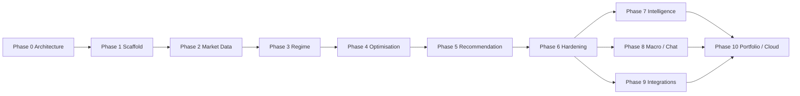

# Development Roadmap

This roadmap sequences foundation work first. Cadence is expressed as **phases and exit criteria**, not calendar estimates.

---

## Phase 0 — Architecture & contracts *(this deliverable)*

**Objectives**

- Complete system, data, AI, engine, plugin, and desktop architecture
- Align tech stack and monorepo layout

**Exit criteria**

- [x] Architecture docs published in-repo
- [x] Principles + tech stack decisions recorded
- [ ] Stakeholder review sign-off (product / eng)

**Artifacts:** `docs/architecture/**`, `docs/roadmap/**`, root `README.md`

---

## Phase 1 — Monorepo scaffold & contracts

**Objectives**

- Create pnpm/turbo monorepo skeletons: `desktop`, `local-api`, `python-engine`, `packages/*`
- Establish shared `contracts` + `proto`
- Boot Electron shell talking to a stub local API
- Prisma schema v1 + empty workspace creation
- Seed instruments (6 symbols)
- CI: lint, typecheck, unit smoke

**Exit criteria**

- App launches to a shell with navigation placeholders
- Workspace SQLite created on first run
- CI green on mainline

**Non-goals:** real charts, full ingest, ML

---

## Phase 2 — Market data foundation

**Objectives**

- CSV ingest job → Parquet segments + series metadata
- Data quality report UI
- Windowed bar queries
- Chart surface with Lightweight Charts (OHLCV + basic markers)
- Fingerprint stability

**Exit criteria**

- All six v1 markets importable from sample CSVs
- Chart pan/zoom on large series without UI freeze
- Quality issues visible and stored

---

## Phase 3 — Jobs, structure, regime skeleton

**Objectives**

- Durable job orchestrator + progress IPC
- Structure snapshot computation (Python) stub → real features incrementally
- Regime taxonomy + detector v1 (rules/HMM/classifier — pick incremental)
- Regime timeline UI
- Artifact conventions enforced

**Exit criteria**

- User can recompute regime for an instrument/timeframe
- Snapshot persisted with engineVersion + data fingerprint
- Worker crash surfaces as failed job without killing UI

---

## Phase 4 — Optimisation engine MVP

**Objectives**

- Strategy definition schema + simple evaluator stub
- Grid/random search with constraints
- Walk-forward folds
- Trials parquet + summaries
- Plateau detection v1
- Optimisation run explorer UI

**Exit criteria**

- End-to-end optimisation job completes on sample strategy
- OOS metrics visible; IS-only runs marked not recommendation-eligible
- Cancel works

---

## Phase 5 — Recommendation engine MVP

**Objectives**

- Candidate generation from plateaus/trials
- Suitability × robustness scoring
- Overfit assessment
- Explanation templates
- Recommendations UI (flagship)
- Accept/reject feedback storage
- Parameter export JSON

**Exit criteria**

- Given sample opt memory + regime, app produces explained top-K params
- Overfit risk visible before accept
- Feedback persisted

**Product milestone:** *First useful closed loop for traders*

---

## Phase 6 — Hardening & commercial baseline

**Objectives**

- Settings + keychain secrets
- Backups / workspace export MVP
- Plugin host + CSV plugin extraction
- Observability pack (doctor, log export)
- Performance budgets validated
- Installers + code signing pipeline
- Security review (Electron)

**Exit criteria**

- Packaged builds for target OSes
- Crash/recovery tested
- Secrets never appear in DB/logs

---

## Phase 7 — Intelligence deepening

**Objectives**

- Stronger regime models + evaluation harness
- Bayesian search option
- Monte Carlo stage
- Learning priors from feedback/outcomes (gated)
- Outcome import from bot results
- DuckDB analytical acceleration if needed

**Exit criteria**

- Measurable lift on golden evaluation sets
- Priors can be disabled and versioned
- Monte Carlo summaries attach to runs

---

## Phase 8 — Macro, news, assistants

**Objectives**

- Economic calendar adapter + macro features
- News ingest plugin (optional)
- AI chat with tool-calling + RAG over explanations
- Local and cloud LLM adapters

**Exit criteria**

- Recommendations can cite macro proximity when available
- Chat refuses uncitable metrics
- Offline mode remains fully usable without LLM

---

## Phase 9 — Integrations & alerts

**Objectives**

- cTrader parameter / history adapters
- TradingView interop (export/import paths)
- Telegram + desktop notifiers
- Multi-broker port maturation
- Historical replay module

**Exit criteria**

- At least one live broker/history integration in production quality
- Alerts on regime change / recommendation ready
- Replay drives chart clock for research

---

## Phase 10 — Portfolio & cloud

**Objectives**

- Portfolio analysis bounded context
- Cross-instrument recommendation views
- Cloud sync of non-secret workspace slices
- License/entitlements
- Multi-device conflict resolution

**Exit criteria**

- Sync with explicit privacy controls
- Portfolio views consume existing instruments/recs without schema break

---

## Cross-cutting workstreams (all phases)

| Stream | Practice |
|---|---|
| Testing | Vitest / pytest / Playwright smoke on each phase exit |
| Contracts | SemVer; breaking changes require migration notes |
| Docs | Update architecture when ports change |
| UX | Flagship recommendation explainability never regresses |
| Robustness | Curve-fitting defenses remain default-on |

---

## Dependency graph (phases)

---

## v1 definition of done (foundation)

v1 is considered complete when Phases **1–5** land with Phase **6** packaging in progress or complete:

- Modular monorepo with replaceable engines
- Offline SQLite + artifact store
- Ingest + chart for six markets
- Regime + optimisation + recommendation closed loop with explanations
- Plugin SPI present
- No requirement for cloud, LLM, or broker execution

---

## Explicitly deferred (do not pull into v1)

- Full StrategyQuant parity optimiser UI
- Autonomous live trading / order execution
- Social/copy features
- Mobile clients
- Multi-tenant SaaS backend as primary mode

---

## Immediate next engineering actions after approval

1. Initialize monorepo tooling and empty apps per [02-folder-structure.md](../architecture/02-folder-structure.md)
2. Codify Prisma models from [04-database-design.md](../architecture/04-database-design.md) / [05-entity-relationship.md](../architecture/05-entity-relationship.md)
3. Freeze `packages/contracts` v0.1 for jobs, instruments, recommendations
4. Implement Phase 1 Electron ↔ local-api IPC hello path
5. Add sample OHLCV fixtures under `data/samples/` for the six markets
